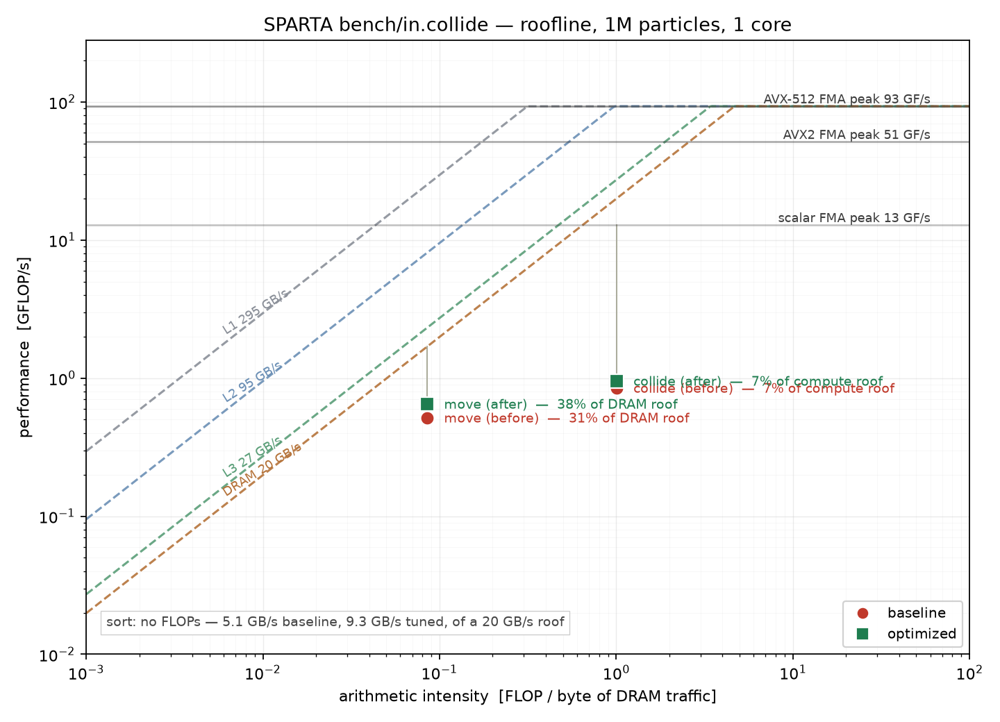

# CPU optimization study of `bench/in.collide`

A profile-guided optimization pass over SPARTA's serial CPU performance on the
`in.collide` DSMC benchmark: measure a baseline, profile it, quantify the remaining
headroom with a roofline, optimize, remeasure.

**Round 1: 1.20x at 1M particles**, from changes that reproduce the baseline output
bit for bit. **Round 2** diagnosed what remains: the step is limited by the size of
the 96-byte particle record, 32 bytes of which are dead for this class of run.
**Round 3** answered the layout question — **SoA > AoSoA > AoS**, by 3.31x and
1.89x over AoS-96 in a full rebuild of the timestep — and then measured, in
SPARTA rather than in a proxy, how much of a byte saving actually reaches
runtime. The elasticity is ~0.4, which puts a 64-byte record at **1.14x, not the
1.58x** the microbenchmark predicted. Every algorithmic restructuring tried
across both rounds (cache tiling, pass fusion, fixed-capacity buckets, mesh-free
binning, a branchless mover, index-only binning) is worth at most 1.26x in a
microbenchmark and ~1.05x or less in the real code. See `ROUND3.md`.

## Read in this order

| document | what is in it |
|---|---|
| [`ROUND4.md`](ROUND4.md) | round 4: does turning reordering off rescue AoSoA (no), are SoA grid cells worth it (no, zero measured elasticity), and a rebuilt mini-app that validates itself against SPARTA and cut the prediction error from 38% to 3% |
| [`ROUND3.md`](ROUND3.md) | round 3: AoS vs SoA vs AoSoA (SoA wins by 3.31x in the model), and a direct in-situ measurement of how much of any byte saving actually reaches SPARTA's runtime — which corrects round 2's headline recommendation |
| [`ROUND2.md`](ROUND2.md) | round 2: what the bottleneck actually is (the 96-byte particle record), the full design-space exploration, and why tiling / fusion / buckets / mesh-free all lose to simply shrinking the record |
| [`RESULTS.md`](RESULTS.md) | round 1: the reorder-period sweeps, every optimization and its measured effect, verification, and the summary table |
| [`PROFILE.md`](PROFILE.md) | gprof and callgrind profiles of the baseline: instruction mix, cache misses, branch behaviour |
| [`ROOFLINE.md`](ROOFLINE.md) | measured machine ceilings, per-kernel arithmetic intensity, and what the plot says about remaining headroom |



## Scripts

| script | purpose |
|---|---|
| `run_bench.sh -b BIN -s SIZE -r PERIOD -n REPS` | time one configuration; reports median, spread, and SPARTA's own section breakdown |
| `sweep_reorder.sh BIN SIZE REPS` | sweep `global particle/reorder` over 0,1,2,5,10,20,50,100 |
| `verify.sh REF NEW SIZE PERIOD` | assert two binaries produce identical per-step physics output |
| `regress.sh REF NEW` | same check across in-tree examples covering surfaces, chemistry, ambipolar, multi-group and the non-optmove move |
| `profile.sh gprof\|callgrind BIN TAG` | run a profiler and summarize |
| `build.sh FLAVOR TAG` | build a binary with a named flag set into `bin/` |
| `make_kernels.py`, `roofline.py` | compute kernel arithmetic intensities and draw the roofline |

`SIZE` is `10K`, `100K`, `1M`, `10M` (the sizes documented in `bench/README`) or an
explicit `x,y,z`.

## Microbenchmarks

`micro/` holds standalone drivers, so a variant can be tried in seconds rather than
minutes. Build any of them with `g++ -O3 -std=c++11 -o NAME NAME.cpp`
(`machine_peak` additionally wants `-march=native`).

| driver | question it answers |
|---|---|
| `machine_peak.cpp` | what are this machine's real bandwidth and FLOP ceilings, and what does a `pow`/`sqrt`/`sin` actually cost? |
| `micro_move.cpp` | hash vs flat-array cell lookup, and does the `cells[].proc` load matter? |
| `micro_sort.cpp` | `sort()`+`reorder()` vs a fused counting sort, checked for identical ordering |
| `micro_collide.cpp` | virtual vs inlined, `plist` vs contiguous, `pow` vs fast `pow` |
| `micro_pow.cpp` | `pow` throughput *and* latency, which turned out to be the distinction that mattered |
| `micro_thp.cpp` | do huge pages help the counting sort's scattered writes? |
| `mini_dsmc.cpp` | **the faithful one.** SPARTA's real structures at real sizes with real indirections, move and collide transcribed from the actual kernels, an equilibration phase, and a `-validate` mode that checks its reorder curve against SPARTA's before it is allowed to predict anything |
| `micro_layout.cpp` | AoS vs SoA vs AoSoA(8,16), crossed with permuting the particles vs binning indices only |
| `micro_design.cpp` | the round-2 design space: nine ways to structure the whole timestep, from the current three passes to tiled fusion, per-cell buckets, mesh-free binning and smaller particle records |

## Benchmark input

`bench/in.collide.opt` is `bench/in.collide` plus `global optmove yes` and
`global particle/reorder ${reorder}`, with the reorder period settable from the
command line. Its default of 2 is the measured optimum after the round-2 changes
(it was 3 after round 1, and 5 before either).

```
cd bench
../src/spa_serial -var x 40 -var y 50 -var z 50 -var reorder 3 < in.collide.opt
```
