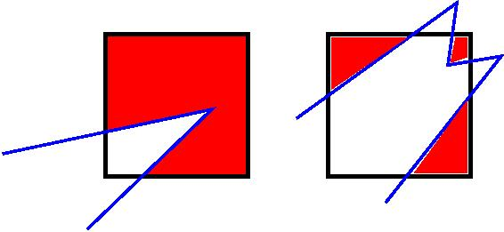
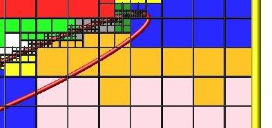

.. _howto_8:

Details of grid geometry in SPARTA
==================================

SPARTA overlays a grid over the simulation domain which is used to
track particles and to co-locate particles in the same grid cell for
performing collision and chemistry operations.  Surface elements are
also assigned to grid cells they intersect with, so that
particle/surface collisions can be efficiently computed.

SPARTA uses a Cartesian hierarchical grid.  Cartesian means that the
faces of a grid cell, at any level of the hierarchy, are aligned with
the Cartesian xyz axes.  I.e. each grid cell is an axis-aligned
parallelepiped or rectangular box.

The hierarchy of grid cells is defined for N levels, from 1 to N.  The
entire simulation box is a single parent grid cell, conceptually at
level 0.  It is subdivided into a regular grid of Nx by Ny by Nz cells
at level 1.  "Regular" means all the Nx\*Ny\*Nz sub-divided cells within
any parent cell are the same size.  Each of those cells can be a child
cell (no further sub-division) or it can be a parent cell which is
further subdivided into Nx by Ny by Nz cells at level 2.  This can
recurse to as many levels as desired.  Different cells can stop
recursing at different levels.  The Nx,Ny,Nz values for each level of
the grid can be different, but they are the same for every grid cell
at the same level.  The per-level Nx,Ny,Nz values are defined by the
:doc:`create\_grid <create_grid>`, :doc:`read\_grid <read_grid>`,
:doc:`adapt\_grid <adapt_grid>`, or :doc:`fix\_adapt <fix_adapt>` commands.

As described below, each child cell is assigned an ID which encodes
the cell's logical position within in the hierarchical grid, as a
32-bit or 64-bit unsigned integer ID.  The precision is set by the
-DSPARTA\_BIG or -DSPARTA\_SMALL or -DSPARTA\_BIGBIG compiler switch, as
described in :ref:`Section 2.2 <start_2>`.  The number of
grid levels that can be used depends on this precision and the
resolution of the grid at each level.  For example, in a 3d
simulation, a level that is refined with a 2x2x2 sub-grid requires 4
bits of the ID.  Thus a maximum of 8 levels can be used for 32-bit IDs
and 16 levels for 64-bit IDs.

This manner of defining a hierarchical grid allows for flexible grid
cell refinement in any region of the simulation domain.  E.g. around a
surface, or in a high-density region of the gas flow.  Also note that
a 3d oct-tree (quad-tree in 2d) is a special case of the SPARTA
hierarchical grid, where Nx = Ny = Nz = 2 is used at every level.

An example 2d hierarchical grid is shown in the diagram, for a
circular surface object (in red) with the grid refined on the upwind
side of the object (flow from left to right).  The first level coarse
grid is 18x10.  2nd level grid cells are defined in a subset of those
cells with a 3x3 sub-division.  A subset of the 2nd level cells
contain 3rd level grid cells via a further 3x3 sub-division.

.. image:: JPG/refine_grid.jpg
   :align: center

In the rest of the SPARTA manual, the following terminology is used to
refer to the cells of the hierarchical grid.  The flow region is the
portion of the simulation domain that is "outside" any surface objects
and is typically filled with particles.

* root cell = the overall simulation box
* parent cell = a grid cell that is sub-divided (the root cell is a parent cell)
* child cell = a grid cell that is not sub-divided further
* unsplit cell = a child cell not intersected by any surface elements
* cut cell = a child cell intersected by one or more surface elements, resulting in a single flow region
* split cell = a child cell intersected by two or more surface elements, resulting in two or more disjoint flow regions
* sub cell = one disjoint flow region portion of a split cell

Note that in SPARTA, parent cells are only conceptual.  They do not
exist as individual entities or require memory.  Child cells store
various attributes and are distributed across processors, so that each
child cell is owned by exactly one processor, as discussed below.

When surface objects are defined via the :doc:`read\_surf <read_surf>`
command, they intersect child cells.  In this context "intersection" by
a surface element means a geometric overlap between the area of the
surface element and the volume of the grid cell (or length of element
and area of grid cell in 2d).  Thus an intersection includes a surface
triangle that only touches a grid cell on its face, edge, or at its
corner point.  When intersected by one or more surface elements, a
child cell becomes one of 3 flavors: unsplit, cut, or split.  A child
cell not intersected by any surface elements is an unsplit cell.  It
can be entirely in the flow region or entirely inside a surface
object.  If a child cell is intersected so that it is partitioned into
two contiguous volumes, one in the flow region, the other inside a
surface object, then it is a cut cell.  This is the usual case.  Note
that either the flow volume or inside volume can be of size zero, if
the surface only "touches" the grid cell, i.e. the intersection is
only on a face, edge, or corner point of the grid cell.  The left side
of the diagram below is an example, where red represents the flow
region.  Sometimes a child cell can be partitioned by surface elements
so that more than one contiguous flow region is created.  Then it is a
split cell.  Additionally, each of the two or more contiguous flow
regions is a sub cell of the split cell.  The right side of the
diagram shows a split cell with 3 sub cells.

The union of (1) unsplit cells that are in the flow region (not
entirely interior to a surface object) and (2) flow region portions of
cut cells and (3) sub cells is the entire flow region of the
simulation domain.  These are the only kinds of child cells that store
particles.  Split cells and unsplit cells interior to surface objects
have no particles.

Child cell IDs can be output in integer or string form by the :doc:`dump grid <dump>` command, using its *id* and *idstr* attributes.  The
integer form can also be output by the :doc:`compute property/grid <compute_property_grid>`.

Here is how a grid cell ID is computed by SPARTA, either for parent or
child cells.  Say the level 1 grid is a 10x10x20 sub-division (2000
cells) of the root cell (simulation box).  The level 1 cells are
numbered from 1 to 2000 with the x-dimension varying fastest, then y,
and finally the z-dimension slowest.  Consider the 376th level 1 cell.
It would be the 6th cell in the x direction of the grid, 8th cell in
y, and 4th cell in z.  I.e. 376 = (z-1)\*100 + (y-1)\*10 + (x-1) + 1.
Now consider the case where level 2 cells use a 2x2x2 sub-division (8
cells) of level 1 cells and consider the 4th level 2 cell within the
376th level 1 cell.  This would be the 2nd cell in x, 2nd cell in y,
and 1st cell in z.  I.e. 4 = (z-1)\*4 + (y-1)\*2 + (x-1) + 1.

This level 2 cell could itself be a parent cell if it were further
sub-divided, or a child cell if not.  In either case its ID is the
same and is calculated as follows.  The rightmost 11 bits of the
integer ID are encoded with 376.  This is because it requires 11 bits
to represent 2000 cells (1 to 2000) at level 1.  The next 4 bits are
encoded with 4, because it requires 4 bits to represent 8 cells (1 to
8) at level 2.  Thus the level 2 cell ID in integer format is 4\*2048 +
376 = 8568.  In string format it would be 376-4, with dashes
separating each of the levels.  Either of these formats (integer or
string) can be specified as id or idstr for output of grid cell info
with the :doc:`dump grid <dump>` command; see its doc page for more
details.

Note that a child cell has the same ID whether it is unsplit, cut, or
split.  Currently, sub cells of a split cell also have the same ID,
though that may change in the future.

The :doc:`create\_grid <create_grid>` and :doc:`balance\_grid <balance_grid>` and :doc:`fix balance <fix_balance>` commands determine the assignment of child
cells to processors.  If a child cell is assigned to a processor, that
processor owns the cell whether it is an unsplit, cut, or split cell.
It also owns any sub cells that are part of a split cell.

Depending on which assignment options in these commands are used, the
child cells assigned to each processor will either be "clumped" or
"dispersed".

Clumped means each processor's cells will be geometrically compact.
Dispersed means the processor's cells will be geometrically dispersed
across the simulation domain and so they cannot be enclosed in a small
bounding box.

An example of a clumped assignment is shown in this zoom-in of a 2d
hierarchical grid with 5 levels, refined around a tilted ellipsoidal
surface object (outlined in pink).  One processor owns the grid cells
colored orange.  A compact bounding rectangle can be drawn around the
orange cells which will contain only a few grid cells owned by other
processors.  By contrast a dispersed assignment could scatter orange
grid cells throughout the entire simulation domain.

It is important to understand the difference between the two kinds of
assignments and the effects they can have on performance of a
simulation.  For example the create\_grid and read\_grid commands may
produce dispersed assignments, depending on the options used, which
can be converted to a clumped assignment by the balance\_grid command.

Simulations typically run faster with clumped grid cell assignments.
This is because the cost of communicating particles is reduced if
particles that move to a neighboring grid cell often stay
on-processor.  Similarly, some stages of simulation setup may run
faster with a clumped assignment.  Examples are the finding of nearby
ghost grid cells and the computation of surface element intersections
with grid cells.  The latter operation is invoked when the
:doc:`read\_surf <read_surf>` command is used.

If the spatial distribution of particles is highly irregular and/or
dynamically changing, or if the computational work per grid cell is
otherwise highly imbalanced, a clumped assignment of grid cells to
processors may not lead to optimal balancing.  In these scenarios a
dispersed assignment of grid cells to processors may run faster even
with the overhead of increased particle communication.  This is
because randomly assigning grid cells to processors can balance the
computational load in a statistical sense.
