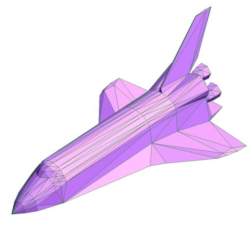

.. _intro_3:

Grids and surfaces in SPARTA
============================

SPARTA overlays a grid over the simulation domain which is used to
track particles and to co-locate particles in the same grid cell for
performing collision and chemistry operations.  SPARTA uses a
Cartesian hierarchical grid.  Cartesian means that the faces of a grid
cell are aligned with the Cartesian xyz axes.  Hierarchical means that
individual grid cells can be sub-divided into smaller cells,
recursively.  This allows for flexible grid cell refinement in any
region of the simulation domain.  E.g. around a surface, or in a
high-density region of the gas flow.

An example 2d hierarchical grid is shown in the diagram, for a
circular surface object (in red) with the grid refined on the upwind
side of the object (flow from left to right).

.. image:: JPG/refine_grid.jpg
   :align: center

Objects represented with a surface triangulation (line segments in 2d)
can also be read in to define objects which particles flow around.
Individual surface elements are assigned to grid cells they intersect
with, so that particle/surface collisions can be efficiently computed.

As an example, here is coarsely triangulated representation of the
space shuttle (only 616 triangles!), which could be embedded in a
simulation box.  Click on the image for a larger picture.

See :ref:`Sections 6.8 <howto_8>` and
:ref:`6.9 <howto_9>` for more details of both the grids and
surface objects that SPARTA supports and how to define them.
