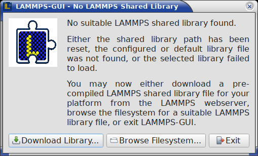
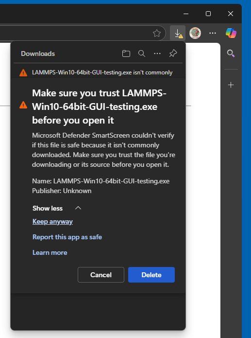
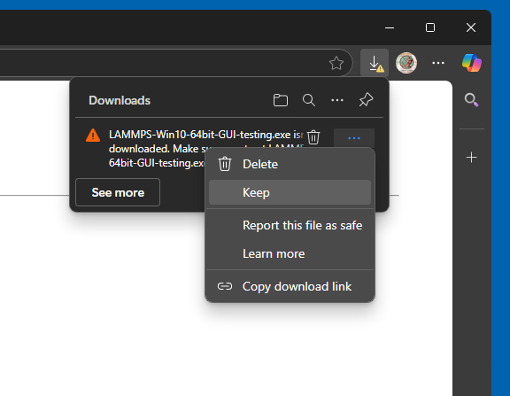
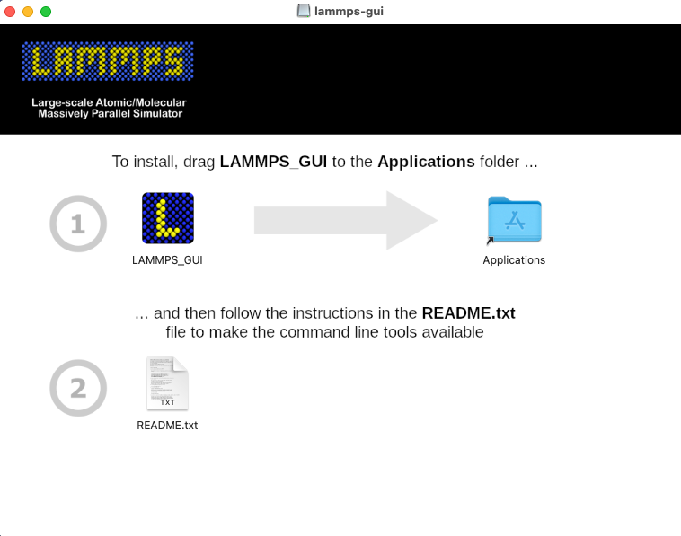
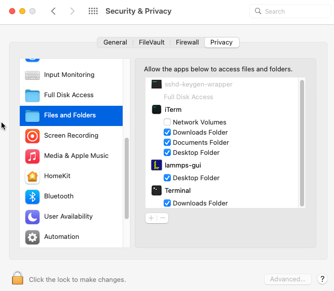
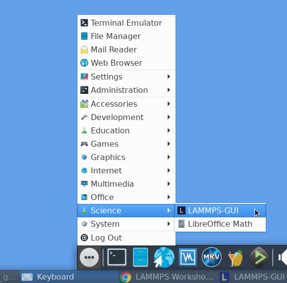

************
Installation
************

.. index:: installation
.. index:: compilation
.. index:: pre-compiled packages

SPARTA-GUI is distributed as `source code on GitHub
<https://github.com/akohlmey/sparta-gui>`_ and can be compiled as part
of compiling SPARTA, where it will be linked to the corresponding
version of SPARTA directly.  Pre-compiled packages of SPARTA with
SPARTA-GUI included are available for download (see below).

SPARTA-GUI can also be compiled as a standalone package that loads the
SPARTA library dynamically at runtime.  This enables using SPARTA-GUI
with customized, patched, or extended SPARTA versions containing
features not available in the official SPARTA distribution packages.  It
also allows using SPARTA-GUI with SPARTA shared libraries compiled
using the traditional makefile based build process (which does not
support compiling SPARTA-GUI directly).  Pre-compiled packages of
standalone SPARTA-GUI versions with a SPARTA shared library included are
also available for download (see below).

Prerequisites and portability
^^^^^^^^^^^^^^^^^^^^^^^^^^^^^

.. index:: prerequisites
.. index:: Qt framework
.. index:: CMake

SPARTA-GUI is programmed in C++ based on the C++17 standard and using
the `Qt GUI framework <https://www.qt.io/development/framework>`_.  As
of SPARTA-GUI version 2.0.0 Qt version 6.2 or later is required.
SPARTA-GUI can switch between a "light" and a "dark" theme according to
the settings of the desktop environment.  Building SPARTA-GUI from
source requires CMake version 3.20 or later and a suitable C++ compiler.

.. admonition:: SPARTA-GUI |version| has been successfully compiled and tested on:

   - Ubuntu Linux 22.04LTS x86\_64 using GCC 11, Qt version 6.2
   - Ubuntu Linux 24.04LTS x86\_64 using GCC 13, Qt version 6.4
   - Fedora Linux 43 x86\_64 using Clang 21, Qt version 6.10
   - Fedora Linux 43 x86\_64 using GCC 15, Qt version 6.10
   - Apple macOS 12 (Monterey) with Xcode 14.2 / AppleClang 14 on arm64 and x86\_64, Qt version 6.5
   - Apple macOS 14 (Sonoma) with Xcode 16.4 / AppleClang 17 on arm64, Qt version 6.8
   - Windows Server 2025 x86\_64 with Visual Studio 2022 and Visual C++ 14.40, Qt version 6.8
   - Windows 11 x86\_64 with Visual Studio 2026 and Visual C++ 14.50, Qt version 6.10
   - Windows 11 x86\_64 with MinGW / GCC 15.2 cross-compiler on Fedora 43, Qt version 6.10

Pre-compiled executables
^^^^^^^^^^^^^^^^^^^^^^^^

.. index:: pre-compiled executables
.. index:: installation; pre-compiled packages

Packages including a full SPARTA version
----------------------------------------

.. index:: full SPARTA packages

For many users and especially for beginners learning to use SPARTA, it
is most convenient to install and use one of the pre-compiled packages
that include both SPARTA-GUI and the command-line version of SPARTA.
In these packages SPARTA-GUI is linked directly to the included SPARTA
library and thus it *cannot* be changed in the :doc:`SPARTA-GUI
preferences dialog <dialogs>`.  Such pre-compiled SPARTA executable
packages are available for download for Linux x86\_64 (Ubuntu 22.04LTS
or later and compatible), macOS (version 12 aka Monterey or later), and
Windows (version 10 or later) from the `SPARTA releases page on GitHub
<https://github.com/sparta/sparta/releases/>`_.  A backup download
location is at https://sparta.github.io/static/ but may not always be
up-to-date.  Occasionally, also test version packages previewing
recently added features are available at
https://sparta.github.io/testing/ .

Standalone packages with a basic SPARTA library
-----------------------------------------------

.. index:: plugin mode
.. index:: standalone packages

SPARTA-GUI packages containing *only* SPARTA-GUI compiled in plugin mode
are available from the `SPARTA-GUI releases page on GitHub
<https://github.com/akohlmey/sparta-gui/releases>`_.  Most of these
packages include a SPARTA shared library with some subset of SPARTA'
features that do not depend on additional libraries for improved
portability.

If you want to override that choice of SPARTA library, you can use the
``-p`` command line flag to tell SPARTA-GUI which other SPARTA shared
library file you want it to load.  By using ``-p ""`` you can also reset
any previous choice and thus trigger loading the default library again.
When resetting the SPARTA shared library path or when the currently
configured library file cannot be loaded or no longer exists, a dialog
will appear that lets you re-download the default minimal SPARTA shared
library from the SPARTA web server or browse the file system for a
suitable custom shared library file.  Once SPARTA-GUI is running, you
can also change the path to the SPARTA shared library or re-download a
pre-compiled copy from the :doc:`Preferences dialog <dialogs>`.

The flatpak version of the standalone SPARTA-GUI package does not
contain a pre-compiled library so it will directly show the download
or browse dialog on the first invocation.  When the flatpak version
is updated, it may be required to reset the shared library location
with ``-p ""`` and re-download the latest version.

.. versionchanged:: 1.8.4

   The minimum SPARTA version required by SPARTA-GUI is now 22 July 2025
   update2

.. versionchanged:: 3.0.1

   The minimum SPARTA version required by SPARTA-GUI is now 4 July 2026

GPU support and MPI parallelization
-----------------------------------

.. index:: GPU support
.. index:: MPI parallelization
.. index:: OpenCL
.. index:: KOKKOS package

The pre-compiled packages include a SPARTA version with support for GPUs
through the GPU package using OpenCL in mixed precision.  However, this
requires that you have a compatible driver and the OpenCL runtime
installed.  This is not always available, and when using the SPARTA
flatpak bundle, the flatpak sandbox usually prevents accessing the GPU
and thus the GPU package is disabled for that version.  GPU support
through the KOKKOS package is currently not available for technical
reasons, but serial and OpenMP multi-threading use of KOKKOS is
available.

The design decisions for SPARTA-GUI and how it launches SPARTA conflict
with parallel runs using MPI.  You have to `use a regular SPARTA
executable <https://sparta.github.io/Run_basics.html>`_ compiled with MPI
support for that.  For the use cases that SPARTA-GUI has been conceived
for (learning SPARTA, testing or debugging SPARTA inputs, prototyping
new projects or complex workflows), this is not a significant
limitation.  Many supercomputing centers and high-performance computing
clusters have parallel SPARTA pre-installed.

Platform notes
--------------

.. index:: platform notes

Windows 10 and later
""""""""""""""""""""

After downloading either the ``SPARTA-Win10-64bit-GUI-<SPARTA version>.exe``
or the ``SPARTA-GUI-Win10-x86_64-<SPARTA-GUI version>.exe`` installer
package, you need to execute it, and start the installation process.
Depending on your security settings of your web browser, you may have to
explicitly tell it to download the file and then confirm **twice** to
*keep the downloaded file* despite the claims that it may be dangerous
and insecure.  Since the installer packages are currently not
cryptographically signed, you may also have to enable "Developer Mode"
in the Windows System Settings to be able to run the installer.

MacOS 12 and later
""""""""""""""""""

.. index:: macOS installation

After downloading the ``SPARTA-macOS-multiarch-GUI-<SPARTA version>.dmg``
or ``SPARTA-GUI-multiarch-<SPARTA-GUI version>.dmg`` application bundle disk
image, you need to double-click it and then -- in the window that opens --
drag the app bundle as indicated into the "Applications" folder.  Afterwards,
the disk image can be unmounted or ejected.  Then follow the instructions in
the "README.txt" file to get access to the other included command-line
executables, if desired.

|macos1| |macos2|

Linux on x86\_64
""""""""""""""""

.. index:: Linux installation

For Linux with x86\_64 CPU there are currently two variants of
pre-compiled SPARTA-GUI: 1) a tar file with binaries and a wrapper
script and 2) a flatpak bundle.  The first is currently compiled on
Ubuntu 22.04LTS (the oldest popular Linux distribution that provides the
required C++17 compatibility out of the box and thus has the best chance
that the pre-compiled binaries will run on current Linux installations)
and depends on the backward compatibility of the core libraries between
different releases on Linux distributions, and should be compatible with
most recent Linux distributions.  The second uses the flatpak sandbox
environment to maintain binary compatibility across platforms, but uses
a more recent build environment and Qt library release than what is
available on Ubuntu 22.04LTS.

*Linux binary tarball*

After downloading and unpacking the
``SPARTA-Linux-x86_64-GUI-<SPARTA version>.tar.gz`` or the
``SPARTA-GUI-Linux-x86_64-<SPARTA-GUI version>.tar.gz`` package,
you can switch into the "SPARTA_GUI" folder and execute
"./sparta-gui" directly:

.. code-block:: bash

   $ cd ~/Downloads
   $ tar -xzvvf SPARTA-Linux-x86_64-GUI-30Mar2026.tar.gz
   $ cd SPARTA_GUI
   $ ./sparta-gui &

The ``SPARTA_GUI`` folder may also be moved around and added to the
``PATH`` environment variable so the executables will be found
automatically.

.. admonition:: Installing required compatibility packages

   Since software is constantly evolving, it may be required to install
   additional software packages for your Linux distribution to achieve
   compatibility with binaries compiled on older distributions.  For
   example the libraries ``libxcb-xinput.so.0`` and
   ``libxcb-xinerama.so.0`` may be missing and you thus get the error

   .. code-block:: console

      qt.qpa.plugin: Could not load the Qt platform plugin "xcb" in "" even though it was found.

   On Ubuntu 24.04, for example, those libraries are in the packages
   ``libxcb-xinput0`` and ``libxcb-xinerama0`` which are not installed
   by default.  Using the flatpak bundle (see below) avoids these kind
   of issues by compiling and running the application in a standardized
   sandbox which is maintained by the flatpak software manager.

*Linux flatpak bundle*

.. index:: flatpak

The second Linux package variant uses `flatpak software deployment
environment <https://flatpak.org>`_ and requires the flatpak management
and runtime software to be installed.  As with the binary tarball, there
are two bundle variants: ``SPARTA-Linux-x86_64-GUI-<SPARTA version>.flatpak``
is built in the SPARTA repository in linked mode and includes the SPARTA
console executable, while ``SPARTA-GUI-Linux-x86_64-<SPARTA-GUI version>.flatpak``
is built in the SPARTA-GUI repository in plugin mode.  After downloading
either bundle, you can install it with:

.. code-block:: bash

   $ cd ~/Downloads
   $ flatpak install --user SPARTA-Linux-x86_64-GUI-<version>.flatpak

After installation, SPARTA-GUI should be integrated into your desktop
environment under "Applications > Science" but also can be launched from
the console with ``flatpak run org.sparta.sparta-gui``.  The flatpak
bundle also includes the console SPARTA executable ``lmp`` which can be
launched to run simulations with, for example with:

.. code-block:: sh

   flatpak run --command=lmp org.sparta.sparta-gui -in in.melt

Other bundled command-line executables are run the same way and can be
listed with:

.. code-block:: sh

   ls $(flatpak info --show-location org.sparta.sparta-gui)/files/bin

---------------

Compilation from source
^^^^^^^^^^^^^^^^^^^^^^^

.. index:: compilation; from source
.. index:: CMake configuration

.. admonition:: History

   The source for SPARTA-GUI was included with the SPARTA source code
   distribution until SPARTA version 22 July 2025 in the folder
   ``tools/sparta-gui``.  Starting with SPARTA-GUI version 1.8.0 and
   SPARTA version 10 September 2025 the SPARTA-GUI sources are
   distributed separately through its own git repository at
   https://github.com/akohlmey/sparta-gui.

SPARTA-GUI can be built as part of a regular SPARTA compilation.  It
will be automatically downloaded from its git repository and configured.
This is usually the most convenient way to compile and install it.
Since `CMake <https://sparta.github.io/Howto_cmake.html>`_ is *required*
to build SPARTA-GUI, you need to build SPARTA with CMake as well.  To
enable its compilation during compiling SPARTA, the CMake variable ``-D
BUILD_SPARTA_GUI=on`` must be set when creating the CMake configuration.
All other settings (compiler, flags, compile type) for SPARTA-GUI are
then inherited from the regular SPARTA build.  If the Qt library is
installed as packaged for Linux distributions, then its location is
typically auto-detected since the required CMake configuration files are
stored in a location where CMake can find them without additional help.
Otherwise, the location of the Qt library installation must be indicated
by setting ``-D Qt6_DIR=/path/to/qt6/lib/cmake/Qt6``, which is a path to
a folder inside the Qt installation that contains the file
``Qt6Config.cmake``.

The charts display is drawn by a self-contained native renderer
(:cpp:class:`PlotWidget`) built only on Qt Widgets and ``QPainter``, so the
build no longer depends on the Qt Charts or Qt Graphs modules.  No extra
CMake settings are required to select a chart backend.

The toolbar and menu icons are bundled in SVG format, so building and
running SPARTA-GUI also requires the **Qt Svg** module, which provides the
SVG icon engine that Qt uses to render them.  On Linux distributions this
module is often packaged separately from the Qt base libraries (for
example the ``qt6-svg-dev`` development package, which pulls in the
``libqt6svg6`` runtime, on Debian and Ubuntu).  The CMake configuration
requires it, and if the module -- or, at run time, its icon-engine plugin
-- is missing, the icons render blank.  The pre-compiled packages and
installers already bundle it.

.. versionchanged:: 2.0.0

   SPARTA-GUI now *requires* Qt 6.2 or later. Support for Qt 5.x has been removed.

SPARTA-GUI plugin version
-------------------------

.. index:: compilation; plugin mode
.. index:: dynamic library loading

It is possible to compile a standalone SPARTA-GUI executable (e.g. when
SPARTA has been compiled with traditional make).  Rather than linking to
the SPARTA library during compilation, it includes a `plugin loader
<https://github.com/akohlmey/sparta-gui/tree/main/plugin>`_ that will
load a SPARTA shared library file dynamically at runtime during the
start of the GUI; e.g. ``libsparta.so.0`` or ``libsparta.0.dylib`` or
``libsparta.dll`` (depending on the operating system).  This has the
advantage that the SPARTA library can be built from updated or modified
SPARTA source without having to (re-)compile the GUI.

The ABI of the SPARTA C-library interface is very stable and generally
backward compatible.  However, features used in SPARTA-GUI may require a
minimum SPARTA version of the library.  SPARTA-GUI will print a suitable
error message and exit if an incompatible SPARTA library is loaded.  You
can override the path to the SPARTA library with the ``-p <path>`` or
``--pluginpath <path>`` command-line flag.  This is usually
auto-detected on the first run and can be changed in the SPARTA-GUI
*Preferences* dialog.  The command-line flag lets you reset this path
to a valid value in case the original setting has become invalid.  An
empty path ("") as argument restores the default setting.

It is also possible to link the standalone compiled SPARTA-GUI version
to the SPARTA library directly.  This feature is enabled by setting ``-D
SPARTA_GUI_USE_PLUGIN=off`` (default setting is on).  This is also the
setting for compilation within SPARTA.  In this case, the CMake
configuration needs to be told where to find the SPARTA headers and the
SPARTA library, via ``-D SPARTA_SOURCE_DIR=/path/to/sparta/src`` and
``-D SPARTA_LIBRARY=/path/to/libsparta/file``

Platform notes
--------------

macOS
"""""

When building on macOS, the build procedure will try to create a
drag-n-drop installer, ``SPARTA-GUI-macOS-multiarch-<version>.dmg``,
when using the 'dmg' target (i.e. ``cmake --build <build dir> --target
dmg`` or ``make dmg``).

To build multi-arch executables that will run on both, arm64 and x86_64
architectures natively, it is necessary to set the CMake variable ``-D
CMAKE_OSX_ARCHITECTURES=arm64;x86_64``.  To achieve wide compatibility
with different macOS versions, you can also set ``-D
CMAKE_OSX_DEPLOYMENT_TARGET=12.0`` which will set compatibility to macOS
12 (Monterey) and later, even if you are compiling on a more recent macOS
version.  These are the settings used when building the pre-compiled
SPARTA-GUI packages.

Windows
"""""""

On Windows either native compilation from within Visual Studio 2022 or
Visual Studio 2026 with Visual C++ is supported and tested, or
compilation with the MinGW / GCC cross-compiler environment on Fedora
Linux.  All pre-compiled SPARTA-GUI packages for Windows are created
with the MinGW64 cross-compiler; the native Visual C++ compilation is a
development configuration without deployment or packaging support.

*Visual Studio*

Using CMake and Ninja as the build system is required.  Qt needs to be
installed; a binary Qt package downloaded from https://www.qt.io was
tested, which installs into the ``C:\\Qt`` folder by default.  The
compilation is verified by a GitHub action for every proposed change,
and the compiled ``sparta-gui.exe`` executable is run directly from the
build folder.  Please note that the pre-compiled SPARTA shared libraries
downloaded by SPARTA-GUI are built with the MinGW64 cross-compiler and
use a different C runtime than Visual C++, so they are not compatible
with a Visual C++ compiled executable; the download options are
therefore disabled in this configuration.  Instead, a SPARTA shared
library must also be compiled with Visual C++ and then either be
selected manually in the ``Preferences`` dialog (plugin mode) or be
linked directly (with ``-D SPARTA_GUI_USE_PLUGIN=no``).

*MinGW64 Cross-compiler*

The standard CMake build procedure for cross-compilation can be applied.
By using the ``mingw64-cmake`` wrapper the CMake configuration will
automatically include a suitable CMake toolchain file (the regular cmake
command can be used after that to modify the configuration settings, if
needed).  After building the libraries and executables, you can build
the target 'nsis' (i.e.  ``cmake --build <build dir> --target nsis`` or
``make nsis``) to build a Nullsoft installer package executable that can
be executed on a Windows 10 or later machine with x86\_64 CPU and will
then install SPARTA-GUI including a basic SPARTA shared library file and
all required dependencies.

Linux
"""""

*Binary tarball package*

Version 6.2 or later of the Qt library is required. Those are provided
by, e.g., Ubuntu 22.04LTS or later.  Thus older Linux distributions are
not likely to be supported, while more recent ones will work, even for
pre-compiled executables (see above).  After compiling with
``cmake --build <build folder>``, use ``cmake --build <build
folder> --target tgz`` or ``make tgz`` to build a
``SPARTA-Linux-amd64.tar.gz`` file with the executables and their
support libraries.

*Flatpak bundle*

It is also possible to build a `flatpak bundle
<https://docs.flatpak.org/en/latest/single-file-bundles.html>`_ which is
a way to distribute applications in a way that is compatible with most
Linux distributions (provided the flatpak system is installed).  Use the
"flatpak" target to trigger a compile (``cmake --build <build
folder> --target flatpak`` or ``make flatpak``).  Please note that this
will not build from the local sources but from the repository and branch
listed in the ``org.sparta.sparta-gui.yml`` SPARTA-GUI source folder.
