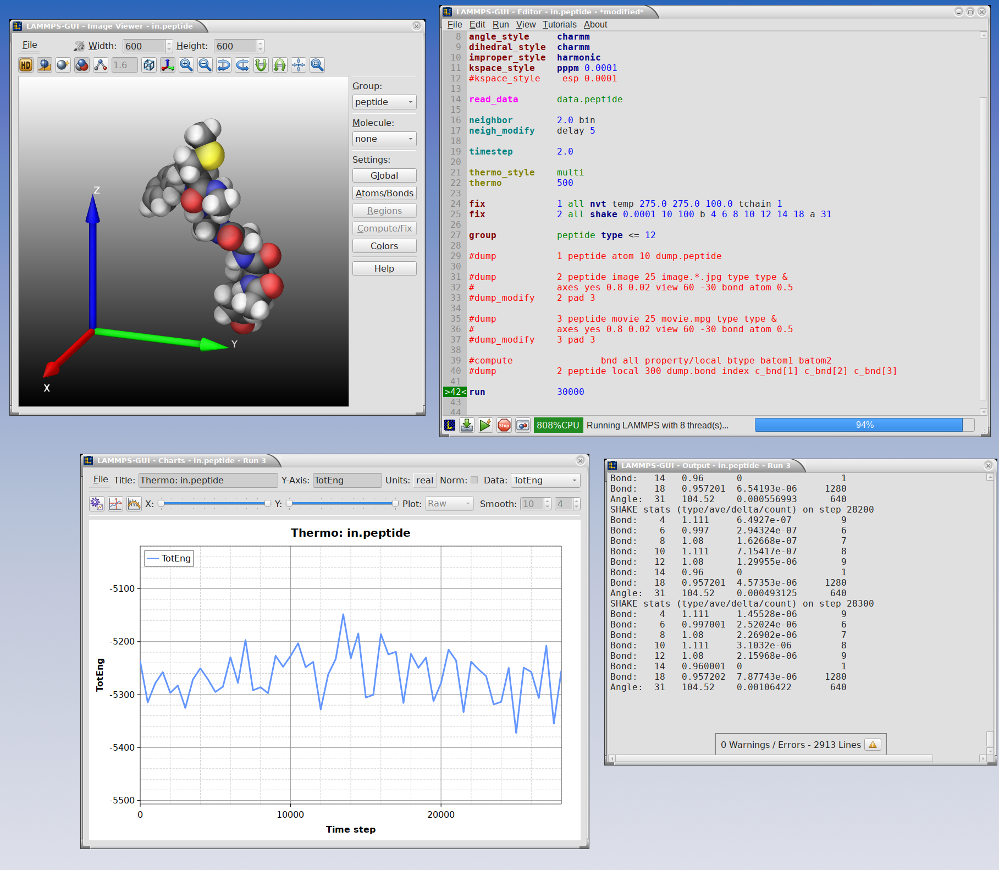

********
Overview
********

.. index:: overview
.. index:: features

SPARTA-GUI is a graphical text editor customized for editing SPARTA
input files.  It uses the `SPARTA C-language library interface
<https://sparta.github.io/Library.html#sparta-c-library-api>`_ and thus
can run SPARTA directly using the contents of the editor's text buffer.
It can retrieve and display information from SPARTA while it is running,
display visualizations created with the `dump image command
<https://sparta.github.io/dump_image.html>`_, and is adapted specifically
for editing SPARTA input files through syntax highlighting, text
completion, and reformatting, and linking to the online SPARTA
documentation for known SPARTA commands and styles.

SPARTA-GUI aims to support a workflow similar to the traditional
experience of running SPARTA using a text editor, a command-line window,
launching the SPARTA text-mode executable printing output to the screen,
and post-processing and visualizing SPARTA' output but just integrated
into a single application.

SPARTA-GUI integrates well with graphical desktop environments where the
``.lmp`` filename extension can be registered with SPARTA-GUI as the
executable to launch when double-clicking on such files using a file
manager.  SPARTA-GUI will launch and read the file into its buffer.
Input files can also be dropped into the editor window of the running
SPARTA-GUI application, which will close the current file and open the
new file.

SPARTA-GUI makes it easier for beginners to get started running SPARTA
and is well-suited for SPARTA tutorials, since you only need to work
with a single, ready-to-use program for most of the tasks.  It is
available for download as a pre-compiled package for popular operating
systems (Linux, macOS, Windows).  This saves time and allows users to
focus on learning SPARTA itself, without the need to learn how to
compile SPARTA, learn how to use the command line, or learn how to use a
separate text editor, plotting or visualization program.

The tutorials at https://spartatutorials.github.io/ are specifically
designed for use with SPARTA-GUI. Their tutorial materials can be
downloaded and edited directly from within the GUI while automatically
loading the matching tutorial instructions into a web browser.

While making it easy for beginners to get started with SPARTA, it is
expected that SPARTA-GUI users will eventually transition to workflows
that most experienced SPARTA users employ.  That traditional procedure
is effective for people proficient in using the command line, as it
allows them to use the tools for the individual steps that they are most
comfortable with.  In fact, it is often *required* to adopt this
workflow when running SPARTA simulations on high-performance computing
facilities.

Most features in SPARTA-GUI have been exposed to keyboard shortcuts,
making it also appealing for experienced SPARTA users for prototyping
and testing simulation setups.

.. admonition:: Features

   A detailed discussion and explanation of all features and functionality
   are in the following pages. Here are a few highlights of SPARTA-GUI:

   - Text editor with line numbers and syntax highlighting customized for SPARTA
   - Text editor features command completion and indentation for known commands and styles
   - Text editor will switch its working directory to the folder of the file in the buffer
   - Indicator for currently executed command
   - Indicator for line that caused an error
   - Progress bar indicates how far a run command has completed and how the CPUs are utilized
   - Context-sensitive help for SPARTA commands via the online documentation
   - Auto-adapting to features and packages available in the SPARTA library in use
   - SPARTA is running in a concurrent thread, so the GUI remains responsive
   - SPARTA can be started and stopped with a mouse click or a hotkey
   - Screen output is captured in an *Output* window
   - Many adjustable settings and preferences are persistent, including the 5 most recent files
   - Thermodynamic output is captured and displayed as a line graph in a *Charts* window
   - Interactive visualization of current state via calling `write_dump
     image <https://sparta.github.io/dump_image.html>`_
   - Capture of images created by `dump image
     <https://sparta.github.io/dump_image.html>`_ in the Slide Show window
   - Dialog to set variables, similar to the SPARTA command-line flag '-v' / '-var'
   - Support for GPU, INTEL, KOKKOS/OpenMP, OPENMP, and OPT accelerator packages
   - Inspection of binary restart files created by SPARTA
   - Integration with `SPARTA tutorials <https://spartatutorials.github.io>`_
