*************
Visualization
*************

.. _snapshot_viewer:

Snapshot Image Viewer
^^^^^^^^^^^^^^^^^^^^^

.. index:: snapshot viewer
.. index:: image viewer
.. index:: visualization
.. index:: dump image

By selecting the *Create Image* entry in the *Run* menu, or by hitting
the `Ctrl-I` (`Command-I` on macOS) keyboard shortcut, or by clicking on
the "palette" button in the status bar of the :doc:`Editor window
<editor>`, SPARTA-GUI sends a custom `write_dump image
<https://sparta.github.io/dump_image.html>`_ command to SPARTA and reads
back the resulting snapshot image with the current state of the system
into an image viewer.  This functionality is *not* available *during* an
ongoing run.  In case SPARTA is not yet initialized, SPARTA-GUI tries to
identify the line with the first `run
<https://sparta.github.io/run.html>`_ or `minimize
<https://sparta.github.io/minimize.html>`_ command and execute all
commands in the editor up to that line, and then executes a "run 0"
command.  This initializes the system so an image of the initial state
of the system that can be rendered.  If there was an error in that
process, a dialog with the error message will appear.

Automatic settings
------------------

When possible, SPARTA-GUI tries to detect which elements the atoms
correspond to (via their mass) and then colorizes them in the image and
sets their atom diameters accordingly.  If this is not possible -- for
instance when using reduced (= 'lj') `units
<https://sparta.github.io/units.html>`_ -- then SPARTA-GUI will check the
current pair style and if it is a Lennard-Jones type potential, it will
extract the *sigma* parameter for each atom type and assign atom
diameters from those numbers.  When using an atom style where the atom
diameters are set directly on a per-atom basis, SPARTA will use that
value.  For cases where atom diameters are not auto-detected or you want
to override the choice, you can configure it in the *Atom/Bond* settings
dialog (see below).  The default value is inferred from the x-direction
lattice spacing.

For particles that use `atom styles
<https://sparta.github.io/atom_style.html>`_ "body", "ellipsoid", "line",
or "tri" SPARTA will visualize the particles according to their atom
style information by default.  Other particle types will be visualized
as spheres.  In the *Atom/Bond* settings dialog, this can be further
customized (or disabled).

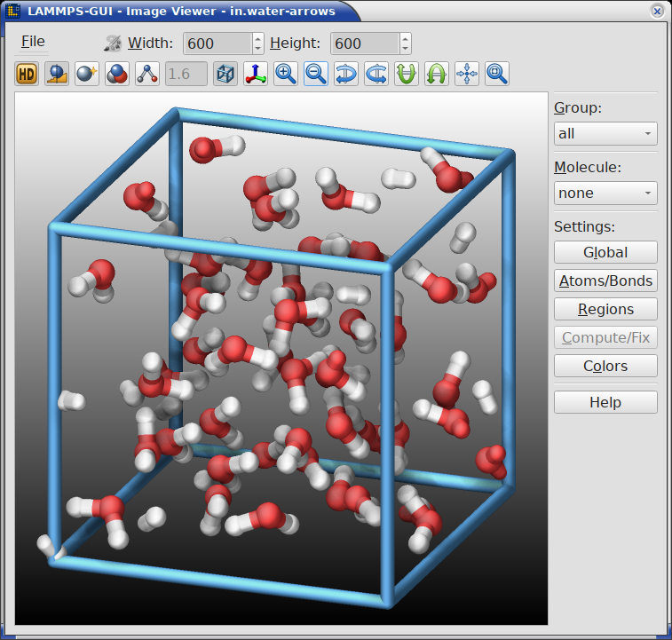

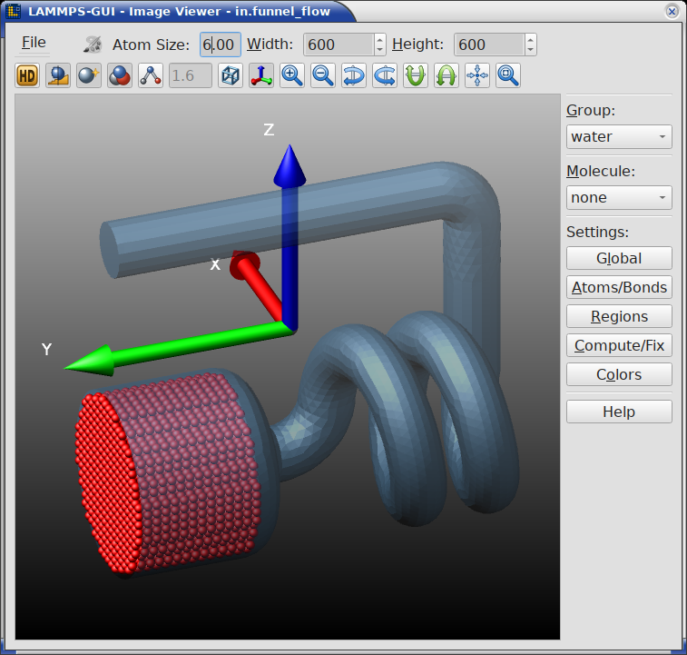

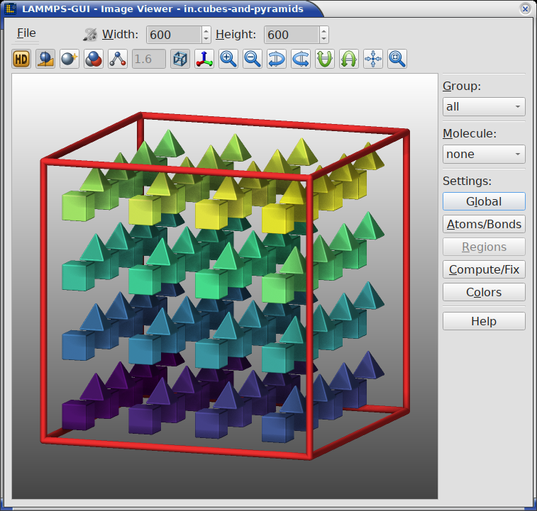

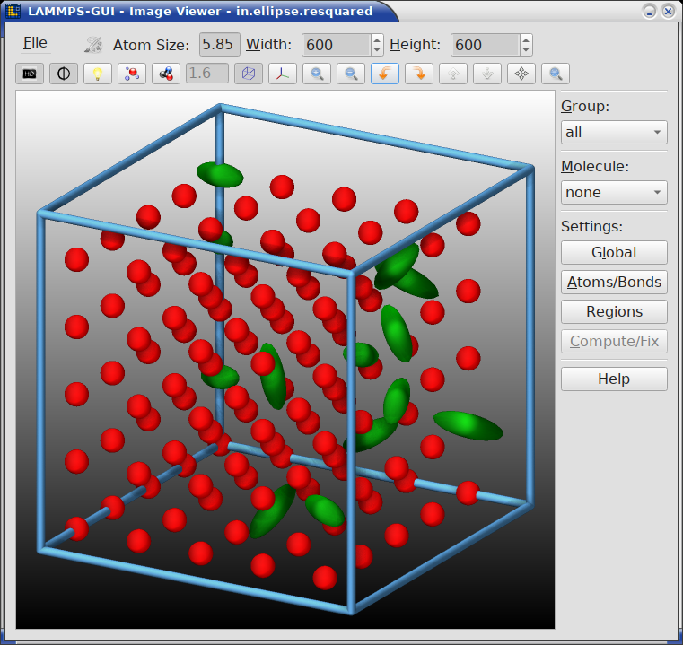

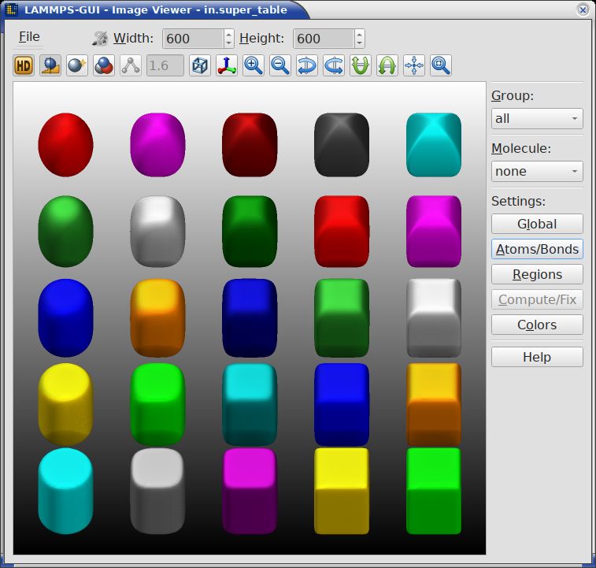

|gui-image1|  |gui-image2|  |gui-image3|  |gui-image4|  |gui-image5|

It is also possible to visualize regions, graphics from computes and
fixes, and have bonds computed dynamically for potentials, where the
bonds are determined implicitly (like `AIREBO
<https://sparta.github.io/pair_airebo.html>`_).  Please see the
documentation of the `dump image command
<https://sparta.github.io/dump_image.html>`_ for more details on these
and other features and the `SPARTA Visualization Howto
<https://sparta.github.io/Howto_viz.html>`_ for more general discussions
on how to generate advanced visualizations with SPARTA directly.

If elements cannot be detected, the default sequence of colors of the
`dump image <https://sparta.github.io/dump_image.html>`_ command is
assigned to the different atom types.

-----------

Customizations
--------------

.. |palette| image:: JPG/emblem-photos.png
                     :width: 14px
.. |inactive| image:: JPG/inactive-photos.png
                     :width: 14px

The Image Viewer controls described below support significant
customization of the default visualization through the toolbar buttons,
editable text fields, and additional dialogs.  This covers a wide
variety of possible customizations.  After each change is applied,
SPARTA-GUI will have SPARTA re-create the displayed image with the
updated settings.  The resulting image can be saved or copied to the
clipboard and pasted into a compatible application.

.. admonition:: Delays in updating the image
   :class: note

   Some visualization settings, especially enabling SSAO and FSAA (see
   below) or massively enlarging the image size, can significantly
   increase the time required for SPARTA to render the image.  While in
   most cases the image will be updated in a fraction of a second,
   complex visualizations may take multiple seconds.  While SPARTA is
   rendering an updated image, the small color palette icon in the
   menu bar is colored |palette| and will be grayed out |inactive| when
   rendering is complete.

For further customization or making the visualization available when
running the simulation with SPARTA directly (e.g. when running on a
cluster after enlarging the system), you can copy the current `dump
image <https://sparta.github.io/dump_image.html>`_ and `dump_modify
<https://sparta.github.io/dump_image.html>`_ commands to the clipboard so
they can be pasted into a SPARTA input file in either the included
:doc:`text editor window <editor>` or some other text editor and
adjusted according to the documentation.

The resulting images will be shown automatically in the :ref:`slide show
viewer <slideshow>` when running the simulation with the thus modified
input from SPARTA-GUI.  This strategy has been used to great effect to
create many of the simulation snapshot images shown in this
documentation and the SPARTA manual.

-----------

Color customizations
--------------------

SPARTA-GUI uses two lists of colors.  The first are the per-type atom
colors that can be customized from a built-in initial assignment.  This
list is maintained by SPARTA-GUI and information from them is passed to
SPARTA via SPARTA commands while creating colors named "type#" where '#'
is the atom type number.  These color definitions can also be written to
and loaded from :ref:`JSON files <json_format>`.  Recent SPARTA versions
have a `dump_modify loadcolors
<https://sparta.github.io/dump_image.html>`_ and *savecolors* command
that can read and write files in the same format.  The second is the
list of named colors that are maintained by the *dump image* command in
SPARTA.  SPARTA-GUI has the list of predefined color names and may
define additional colors as needed, but will give them names that are
specific to SPARTA-GUI and does not attempt to overwrite any of the
predefined colors.

-----------

Available controls
------------------

.. index:: image viewer controls

The Image Viewer window consists of three main areas: a menu/toolbar
strip at the top, the rendered image in the center, and a settings panel
on the right side.  Following the general theme of SPARTA-GUI of
extensive keyboard shortcut support, you can select most text fields by
using the `Alt` key and the underlined letter.  For example the *File*
menu is opened with `Alt-F` and its entries can be also selected the
same way or using the cursor keys and `Enter`.  Keyboard shortcuts
starting with `Ctrl` usually work globally inside the image window, that
is even when the corresponding menu item is not visible.

The **menu/toolbar strip** consists of two rows: the first row with the
*File* menu, atom and bond size controls, image dimension controls, and
a second row of toggle and action buttons.

The **menu bar row** has:

- The **File** menu with the following entries:
   - **Save As...** (`Ctrl-S`): Save the rendered image to a file.  The
     file format is inferred from the file name extension.  When the
     `ImageMagick software <https://imagemagick.org/>`_ is installed,
     additional file formats beyond those natively supported by the Qt
     library become available.
   - **Copy Image** (`Ctrl-C`): Copy the rendered image to the clipboard
     for pasting it into another application.  This requires support
     from the receiving application, which is the case for many common
     applications like document editors and web browsers.
   - **Copy dump image command** (`Ctrl-D`): Copy the current `dump image
     <https://sparta.github.io/dump_image.html>`_ and `dump_modify
     <https://sparta.github.io/dump_image.html>`_ commands to the clipboard
     so they can be pasted into a SPARTA input file in either the included
     :doc:`text editor window <editor>` or some other text editor.  This
     allows the current visualization settings to be reproduced during a
     simulation run, including in the :ref:`slide show viewer <slideshow>`.
   - **Load Colors/Lights from JSON File...**: Load a list of
     definitions for per-type colors and settings for the four light
     sources from a :ref:`JSON format file <json_format>`.  The list of
     colors may contain either more or fewer definitions than the
     current system has atom types. In the latter case the colors "wrap
     around", that is colors are read from the list multiple times.
   - **Save Colors/Lights to JSON File...**: Save the currently used
     list of definitions for per-type colors and the current lighting
     settings to a :ref:`JSON format file <json_format>`.  The list may
     be loaded later to restore a previous color and lighting
     assignment, since these settings are reset when the Image Viewer
     dialog is restarted.
   - **Reset Colors**: Reset the list of per-type colors to a compiled
     in default list.
   - **Close** (`Ctrl-W`): Close the Image Viewer window.
   - **Quit** (`Ctrl-Q`): Quit the entire application.
- The **busy indicator**, a small palette icon that is colored |palette|
  while SPARTA is rendering a new image and grayed out |inactive| when
  rendering is complete.
- The **Atom size** text field, where the atom diameter can be
  adjusted.  This field is only visible when the atom diameter is not
  automatically set.
- The **Bond size** text field, where the bond diameter can be
  adjusted.  This field is only visible when the bond diameter is not
  automatically set and display of explicit or implicit bonds is enabled
- The **Width** spin box where the image width can be set.  It can be
  accessed using the `Alt-W` keyboard shortcut.
- The **Height** spin box, where the image height can be set.  It can
  be accessed using the `Alt-H` keyboard shortcut.

The **toolbar buttons** row below the menu bar provide quick access to
several rendering options and view manipulations.  From left to right
there are:

- **SSAO** (toggle): Enable or disable `Screen Space Ambient Occlusion
  <https://en.wikipedia.org/wiki/Screen_space_ambient_occlusion>`_
  rendering for a more spatial, depth-shaded appearance, at the
  expense of more CPU time.
- **Anti-aliasing** (toggle): Render the image at double resolution and
  scale down for smoother edges.  `Full Scene Anti-Aliasing (FSAA)
  <https://en.wikipedia.org/wiki/Spatial_anti-aliasing#Super_sampling_/_full-scene_anti-aliasing>`_
  produces higher quality images at the expense of more CPU time.  It is
  particularly recommended in combination with any transparent objects.
- **Shininess** (toggle): Switch between shiny and matte surface
  rendering of graphics objects like atoms and bonds.
- **VDW style** (toggle): Switch between space-filling (Van der Waals)
  sphere representation of atoms and the smaller ball-and-stick style
  of atoms and bonds.
- **Dynamic bonds** (toggle): Automatically compute bonds from atom
  distances.  This is useful for force fields with implicit bonds.  When
  enabled, the adjacent text field allows setting the bond cutoff
  distance.  This feature depends on existing neighbor list data and thus
  may not always work as expected when the system has explicit bonds and
  thus neighbors may be automatically excluded from neighbor lists due
  to the `special_bonds settings
  <https://sparta.github.io/special_bonds.html>`_
- **Box** (toggle): Show or hide the simulation box drawn as colored
  cylinders.
- **Axes** (toggle): Show or hide the labeled coordinate axes arrows.
- **Zoom in** / **Zoom out**: Adjust the zoom level in 10
  percent increments between 0.1x and 10.0x.
- **Rotate left** / **Rotate right**: Rotate the view horizontally by
  10 degrees per click.
- **Rotate up** / **Rotate down**: Rotate the view vertically by
  10 degrees per click.
- **Recenter**: Recenter the view on the center of mass of the currently
  selected group.
- **Reset**: Reset the view to the default orientation and zoom level.
- **Fit window**: Resize the window so the image is shown at its full
  size, without scroll bars or unused space.  This undoes a manual
  resize of the window; the window is never grown beyond a fraction of
  the screen, so scroll bars remain for very large images.

  .. versionadded:: 3.0.2

The default image size, some default image quality settings, the view
style and some colors can be changed in the :doc:`Preferences <dialogs>`
dialog window.  From the image viewer window further adjustments can be
made: actual image size, high-quality (SSAO) rendering, anti-aliasing,
view style, display of box or axes, zoom factor.  The view of the system
can be rotated horizontally and vertically.

The **settings panel** on the right side of the window provides
additional controls (most are explained in detail below):

- **Group**: A drop-down list to select which `group
  <https://sparta.github.io/group.html>`_ of atoms to display (default
  is "all").  Only atoms belonging to the selected group are rendered.
- **Molecule**: A drop-down list to select a `molecule
  <https://sparta.github.io/molecule.html>`_ to visualize (default is
  "none").  When a molecule is selected, it is shown at the center of
  the simulation box, and the group selection is disabled.  Selecting
  "none" restores normal group-based display.
- **Global**: Opens the :ref:`Global image settings <global_settings>`
  dialog for fine-grained control of axes, box, background, quality,
  view, center, and camera settings.
- **Atoms/Bonds**: Opens the :ref:`Atom and bond settings
  <atom_settings>` dialog for detailed atom, bond, VDW, and special atom
  style visualization options.
- **Regions**: Opens the :ref:`Region settings <region_settings>` dialog
  to configure visualization of `regions
  <https://sparta.github.io/region.html>`_ defined in the simulation.
- **Compute/Fix**: Opens the :ref:`Compute and fix graphics
  <fix_settings>` dialog to enable and configure extra graphics objects
  provided by `selected compute and fix styles
  <https://sparta.github.io/Howto_viz.html#visualizing-graphics-provided-by-compute-or-fix-commands>`_.
- **Colors**: Opens the :ref:`Atom Type Color Customization <customcolors>`
  dialog where the current list of colors used for per-type coloring
  can be customized and saved or loaded from a file.
- **Help**: Opens this online documentation page for the visualization
  features in SPARTA-GUI in a web browser.

The image is re-rendered after each change to the buttons, text fields
or settings dialogs, and when there are many atoms to render and high
quality images with anti-aliasing are requested, re-rendering may take
several seconds.  Some time consuming rendering steps are
multi-threaded, but there is no GPU acceleration.

---------------

.. _global_settings:

Global image settings
---------------------

.. index:: image settings
.. index:: global image settings
.. index:: dump_modify

While some persistent default settings for the image output can be
configured in the "Snapshot Image" tab of the :ref:`Preferences dialog
<image_preferences>`, more fine-grained configuration is possible by
opening the "Global image settings" dialog.  However, settings not
stored by the preferences are reset when the image viewer window is
closed.  This dialog is opened by pressing the "Global" button in the
settings panel or by using the `Alt-L` keyboard shortcut.  The settings
in this dialog correspond to options of the SPARTA `dump image and
dump_modify commands <https://sparta.github.io/dump_image.html>`_.

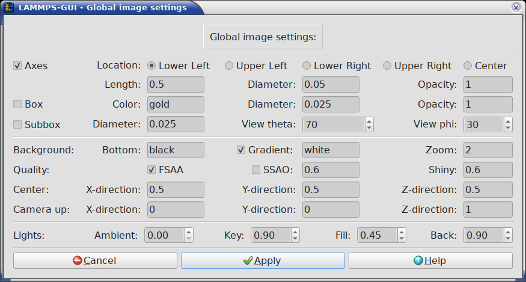

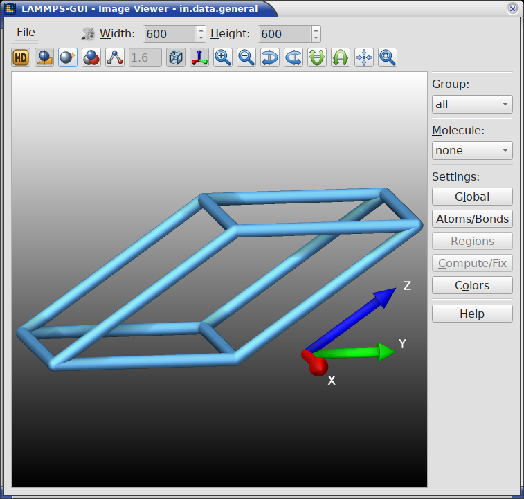

|boxaxes|  |global|

The dialog is organized into the following sections:

**Axes**
   Controls the display of coordinate axes arrows in the image.

   - **Axes** (checkbox): Enable or disable rendering of coordinate axes.
   - **Location** (radio buttons): Select where the axes are drawn in
     the image.  Possible choices are: *Lower Left* (default), *Lower
     Right*, *Upper Left*, *Upper Right*, or *Center*.
   - **Length**: The length of the axes arrows as a fraction of the box
     size (range: 0.00001 -- 5.0).
   - **Diameter**: The diameter of the axes arrows as a fraction of the
     box size (range: 0.00001 -- 5.0).
   - **Opacity**: The transparency of the axes (range: 0.0 -- 1.0, where
     1.0 is fully opaque and 0.0 is fully transparent).

**Box**
   Controls the display of the simulation box.

   - **Box** (checkbox): Enable or disable rendering of the simulation
     box.
   - **Color**: The color used to draw the box edges.  Accepts
     `named colors <https://sparta.github.io/dump_image.html>`_.
   - **Diameter**: The diameter of the box edge sticks as fraction
     of the box size (range: 0.000001 -- 5.0).
   - **Opacity**: The transparency of the box edges (range: 0.0 -- 1.0,
     where 1.0 is fully opaque and 0.0 is fully transparent)

**Subbox**
   Controls the display of the per-processor sub-domain boxes
   (relevant for MPI parallel simulations, will coincide with the
   regular box for SPARTA-GUI runs).

   - **Subbox** (checkbox): Enable or disable rendering of the sub-domain
     box.
   - **Diameter**: The diameter of the sub-domain box edge sticks as
     fraction of the box size (range: 0.00001 -- 5.0).
   - **View theta**: The viewing angle in degrees away from the
     positive z-axis (default: 60).  Disabled for 2d systems, where
     SPARTA always looks down the z-axis.
   - **View phi**: The azimuthal viewing angle in degrees around the
     z-axis (default: 30).  Disabled for 2d systems.

**Background**
   Sets the background color(s) of the rendered image.

   - **Bottomcolor**: The background color at the bottom of the image.
   - **Topcolor**: The background color at the top of the image.  If
     the two colors differ, a vertical gradient is applied from bottom
     to top.
   - **Zoom**: The zoom factor of the view (range: 0.1 -- 10.0, where
     values larger than 1.0 zoom in).  This is the same setting that
     the zoom in/out buttons of the settings panel change in steps of
     10 percent.

**Quality**
   Controls rendering quality options.

   - **FSAA** (checkbox): Enable or disable full-scene anti-aliasing.
   - **SSAO** (checkbox): Enable or disable Screen Space Ambient
     Occlusion for depth-shaded rendering.
   - **SSAO strength**: The strength of the SSAO effect (range: 0.0 --
     1.0).
   - **Shiny**: The shininess factor for surface rendering (range: 0.0
     -- 1.0, where 0.0 is matte and 1.0 is fully shiny).

**Center**
   Adjusts the center point of the rendered view.

   - **X-direction**, **Y-direction**, **Z-direction**: Fractional
     coordinates (range: 0.0 -- 1.0) specifying the center of the
     view relative to the simulation box.

**Camera up**
   Sets the direction that points up in the rendered image.

   - **X-direction**, **Y-direction**, **Z-direction**: The components
     of the camera's up vector.  The vector does not need to be
     normalized, but it must not be all zeros, or the values are
     ignored.  The default is 0 0 1 for 3d systems and 0 1 0 for 2d
     systems, where the Z-direction entry is disabled.

**Lighting**
   Adjusts the settings for the four light sources used in the
   rendering.  Each value is a floating point number (range: 0.0 -- 1.0)
   representing the intensity of the respective light source.

   - **Ambient**: The intensity of the uniform, non-directional base
     lighting that illuminates all parts of the scene equally.
   - **Key**: The intensity of the primary, directional light source
     that provides the main illumination and highlights.
   - **Fill**: The intensity of the secondary directional light source
     that fills in the shadows created by the key light.
   - **Back**: The intensity of the tertiary directional light source
     that illuminates the back of the objects, helping to separate
     them from the background.

Press **Apply** to apply the current settings and re-render the image,
or **Cancel** to discard changes.  The **Help** button opens the SPARTA
`dump image <https://sparta.github.io/dump_image.html>`_ documentation.

---------------

.. _atom_settings:

Atoms/bonds settings
--------------------

.. index:: atom settings
.. index:: bond settings
.. index:: VDW style
.. index:: rigid bodies

This dialog offers more detailed customizations for atom and bond
visualization that are not directly accessible from the main Image
Viewer toolbar.  It is opened by pressing the "Atoms/Bonds" button in
the settings panel or by using the `Alt-A` keyboard shortcut.

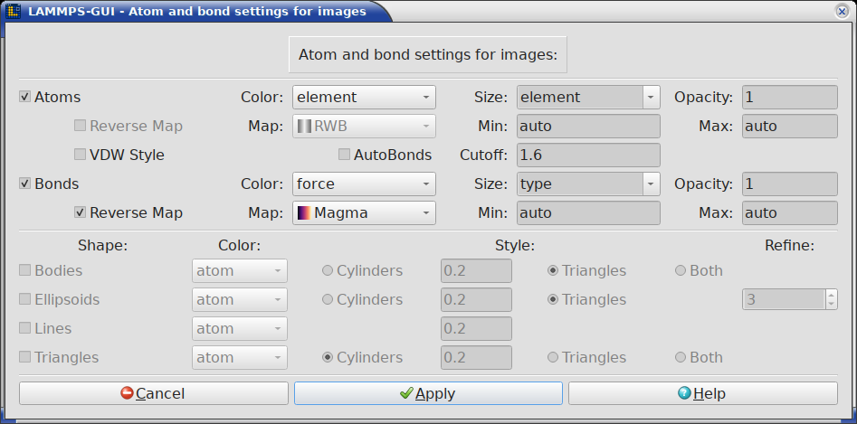

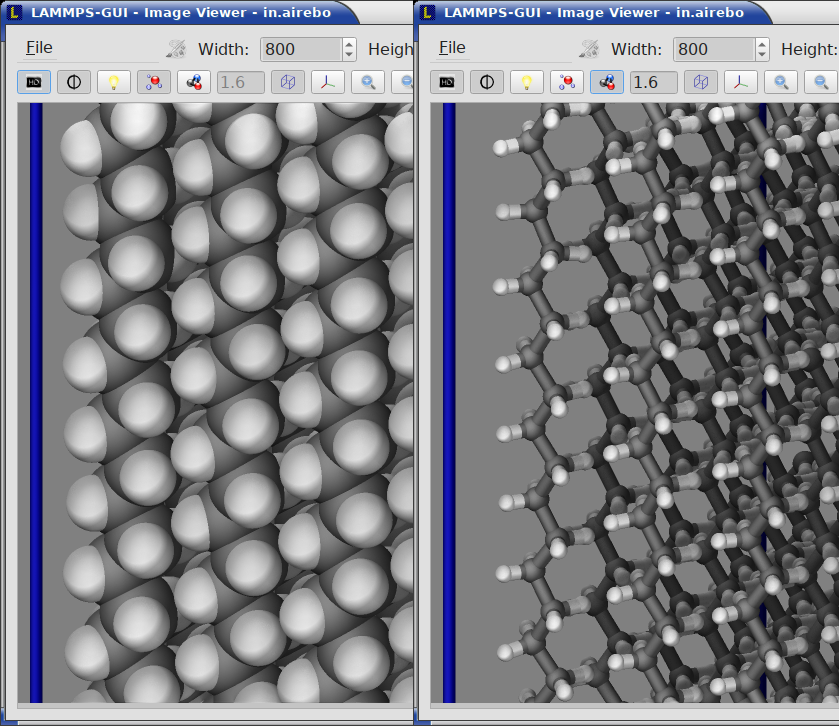

|autobond|  |atombond|

The dialog contains the following sections:

**Atoms**
   Controls how atoms are rendered.

   - **Atoms** (checkbox): Enable or disable rendering of atoms.
   - **Color**: Select the per-atom property used for coloring.
     Options include *type*, *element* (if detected), *mol*, *q*
     (charge), *diameter*, *id*, *mass*, *x*/*y*/*z* (coordinates), as
     well as atom-style variables (`v_<name>`), per-atom compute results
     (`c_<name>` or `c_<name>[col]`), and per-atom fix results
     (`f_<name>` or `f_<name>[col]`).  The contents of the list depends
     on which are available in the current simulation state.  When
     selecting *type* or *element* the colors are fixed and can be only
     changed manually for ``dump_image`` output in the input using
     ``dump_modify acolor`` or ``dump_modify element``, respectively.
     Otherwise, the colors are determined by the color map selection
     described below.
   - **Size**: Select the property used for atom sizing.  Options
     include *auto* (when element, diameter, or sigma data is
     available), *type*, *element*, and a few pre-defined choices for
     custom atom diameters.  The text field can be edited and a
     different custom diameter entered.
   - **Opacity**: The transparency of atoms (range: 0.0 -- 1.0, where 1.0
     is fully opaque and 0.0 is fully transparent).  Bonds have their own
     Opacity setting in the **Bonds** section below.
   - **Map**: Select the color map used for coloring by a per-atom
     property.  This option is *not* available for atom color selections
     *type* and *element*\ .  Currently available continuous color maps
     are: *RWB* (red-white-blue), *PWT*
     (purple-white-teal), *BWG* (blue-white-green), *BGR*
     (blue-green-red), *Grayscale* (black-white), *Viridis* (from
     matplotlib), *Plasma* (from matplotlib), *Inferno* (from
     matplotlib), *Magma* (from matplotlib), *Cividis* (from matplotlib),
     *Turbo* (from matplotlib), *Teal*, and *Rainbow*.  *Sequential*,
     *Landscape*, and *Basic* are maps with discrete colors.  These are pre-defined
     color map settings and currently cannot be adjusted from SPARTA-GUI
     directly.  As for *all* image settings, further customizations can
     be realized by copying the dump image command line as customized by
     the Image Viewer to the editor and then run SPARTA and observe the
     resulting images in the Slide Show window.  Then the color
     map setting can be fully customized according to the `dump_modify
     colormap documentation <https://sparta.github.io/dump_image.html>`_.
   - **Reverse** (checkbox): Mirror the selected color map so its low and
     high ends are swapped (for example, *RWB* becomes blue-white-red).
     This replaces the former *BWR* entry, which is exactly *RWB*
     reversed.  Enabled together with the **Map** selector.
   - **Min** / **Max**: Set the range of the color map.  Use *auto* to
     have SPARTA determine the range automatically or specify an
     explicit numeric value.
   - **VDW style** (checkbox): Enable or disable space-filling sphere
     rendering.  When unchecked, the ball-and-stick style is used.  This
     toggle shares a line with the **AutoBonds** control of the **Bonds**
     section below; the two are mutually exclusive.

.. index:: color map
.. index:: reversible color map

The color maps available for coloring atoms and bonds by value are shown
below; the continuous maps are interpolated between color stops, while
*Sequential*, *Landscape*, and *Basic* use discrete colors.

.. _colormap_preview:

.. figure:: JPG/sparta-gui-colormaps.png
   :align: center
   :width: 60%

   The dump-image color maps offered for coloring atoms and bonds by value.

These color maps are defined in a single table in the C++ source, which makes
them simple to add or modify; see :ref:`add_colormap` in the Programmer's
Guide for step-by-step instructions.

**Bonds**
   Controls bond visualization.

   - **Bonds** (checkbox): Enable or disable bond rendering.  This
     option is only available when the atom style supports explicit
     bonds.
   - **Color**: Select the bond coloring mode.  The basic choices are
     *atom* (each bond half is colored by the atom type at its end) and
     *type* (a uniform color per bond type).  The list also offers a set
     of per-bond properties computed by ``compute bond/local`` -- *dist*,
     *dx*, *dy*, *dz*, *engpot*, *force*, *fx*, *fy*, *fz*, *engvib*,
     *engrot*, *engtrans*, *omega*, and *velvib*.  Selecting one of these
     colors the bonds by that per-bond value using the bond color map (see
     **Map** below); SPARTA-GUI creates the required ``compute
     bond/local`` automatically.
   - **Size**: Select bond diameter mode.  Options include *atom*,
     *type*, and a few pre-defined choices for custom bond diameters.
     The text field can be edited and a different custom diameter
     entered.
   - **Opacity**: The transparency of bonds (range: 0.0 -- 1.0), set
     independently from the atom opacity.
   - **AutoBonds** (checkbox): Automatically determine bonds from atom
     distances, useful for many-body force fields with implicit bonds
     like `AIREBO <https://sparta.github.io/pair_airebo.html>`_ or
     `Tersoff <https://sparta.github.io/pair_tersoff.html>`_.  This
     feature depends on existing neighbor list data and thus may not
     always work as expected when the system has explicit bonds and thus
     neighbors may be automatically excluded from neighbor lists due to
     the `special_bonds settings
     <https://sparta.github.io/special_bonds.html>`_
   - **Cutoff**: The distance cutoff used for automatic bond detection
     (range: 0.001 -- 10.0 in distance units), in the text field next to
     the AutoBonds checkbox.  Only available when auto-bonds are enabled.
   - **Reverse** / **Map** / **Min** / **Max**: Select the color map and
     value range used when coloring bonds by a per-bond value (see
     **Color** above).  The same color maps as the atom **Map** are
     offered, and the **Reverse** checkbox mirrors the chosen map exactly
     like its atom counterpart.  These fields are only enabled when a
     per-bond property is selected as the bond color.  Use *auto* for
     **Min** / **Max** to let SPARTA determine the range automatically.

**Bodies**
   Controls visualization of `body particles
   <https://sparta.github.io/Howto_body.html>`_ (when present in the
   simulation).

   - **Bodies** (checkbox): Enable or disable rendering of body particle
     shapes. When disabled, the particles are rendered as spheres like
     regular atoms.
   - **Color** (selection): Use coloring by the *atom* color choice, the
     body *index*, or the atom *type* of the body particles.
   - **Style** (radio buttons): Select the body rendering style --
     *Cylinders*, *Triangles*, or *Both*.  For cylinders -- when used for
     body particle rendering -- their diameter can also be set (range:
     0.1 -- 10.0).

**Ellipsoids**
   Controls visualization of `aspherical particles
   <https://sparta.github.io/Packages_details.html#pkg-asphere>`_ (when
   present in the simulation).  Particles flagged as ellipsoids are
   represented as a triangle mesh, others as spheres.

   - **Ellipsoids** (checkbox): Enable or disable rendering of ellipsoid
     particle shapes. When disabled, the particles are rendered as
     spheres like regular atoms.
   - **Color** (selection): Use coloring by the *atom* color choice, the
     ellipsoid *index*, or the atom *type* of the ellipsoid particles.
   - **Style** (radio buttons): Select the ellipsoid rendering style --
     *Cylinders*, *Triangles*, or *Both*.  For cylinders -- when used for
     ellipsoid particle rendering -- their diameter can also be set (range:
     0.1 -- 10.0).
   - **Refine** (spinbox): Level of triangle mesh refinement.  At level
     1 the ellipsoids are represented by a deformed octahedron.  With a
     level increase, each triangle is replaced by 4 triangles following
     the ellipsoid shape more closely (max: 6).  At the maximum level
     each ellipsoid is represented by 8192 triangles. At high refinement
     level, there may be artifacts from rounding due to limitations of
     the image rasterizer included in SPARTA.  These can be made less
     prominent by enabling anti-aliasing.

**Lines**
   Controls visualization of `line segment particles
   <https://sparta.github.io/pair_line_lj.html>`_ (when present in the
   simulation).

   - **Lines** (checkbox): Enable or disable rendering of line segment
     particle shapes as connected cylinders.  When disabled, the
     particles are rendered as spheres like regular atoms.  Also the
     cylinder diameter can be set (range: 0.1 -- 10.0).
   - **Color** (selection): Use coloring by the *atom* color choice, the
     line *index*, or the atom *type* of the line particles.

**Triangles**
   Controls visualization of `triangulated particles
   <https://sparta.github.io/pair_tri_lj.html>`_ (when present in the
   simulation).

   - **Triangles** (checkbox): Enable or disable rendering of
     triangulated particle shapes.  When disabled, the particles are
     rendered as spheres like regular atoms.
   - **Color** (selection): Use coloring by the *atom* color choice, the
     triangulated particle *index*, or the atom *type* of the
     triangulated particles.
   - **Style** (radio buttons): Select the particle rendering style --
     *Cylinders*, *Triangles*, or *Both*.  For cylinders -- when used for
     triangle particle rendering -- their diameter can also be set
     (range: 0.1 -- 10.0).

Press **Apply** to apply the settings and re-render the image, or
**Cancel** to discard changes.   The **Help** button opens the SPARTA
`dump image <https://sparta.github.io/dump_image.html>`_ documentation.

--------------

.. _region_settings:

Region settings
---------------

.. index:: region visualization
.. index:: region settings

This dialog allows enabling and configuring the visualization of
`regions <https://sparta.github.io/region.html>`_ defined in the SPARTA
input script.  It is opened by pressing the "Regions" button in the
settings panel or by using the `Alt-R` keyboard shortcut.  The dialog
only appears when at least one region is defined in the current
simulation.

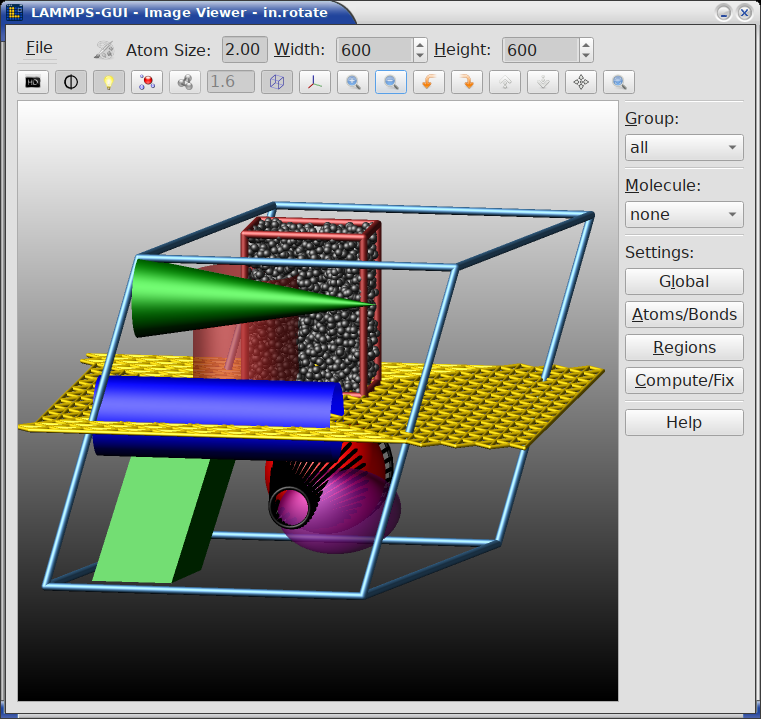

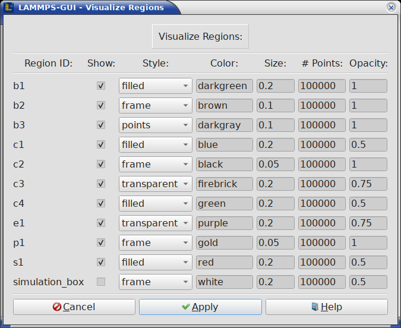

|regionimg|  |regsetting|

For each region, the following settings can be adjusted:

- **Region ID**: The identifier of the region (read-only).
- **Show** (checkbox): Enable or disable visualization of this region.
- **Style**: The rendering style for the region surface -- *frame*
  (wireframe), *filled* (solid), *transparent* (see-through solid), or
  *points* (point cloud).
- **Color**: The color used to render the region.  Accepts `named
  colors <https://sparta.github.io/dump_image.html>`_ or hex color
  values.
- **Size**: The diameter of the lines (for frame style) or points (for
  points style).
- **# Points**: The number of points used to approximate the region
  volume (range: 100 -- 1,000,000).  Higher values reproduce the
  volume better, but may obscure other details of the image.
- **Opacity**: The transparency of the region rendering (range: 0.0 --
  1.0, where 1.0 is fully opaque and 0.0 fully transparent).

Press **Apply** to apply the settings and re-render the image, or
**Cancel** to discard changes.  The **Help** button opens the SPARTA
`visualization howto
<https://sparta.github.io/Howto_viz.html#visualizing-regions>`_
documentation and jumps to the section discussing visualizing regions.

--------------

.. _fix_settings:

Graphics from computes and fixes
--------------------------------

.. index:: image computes
.. index:: image fixes
.. index:: compute graphics
.. index:: fix graphics

Some compute and fix styles can prepare lists of graphics objects for
inclusion into visualizations generated by the `dump image
<https://sparta.github.io/dump_image.html>`_ command.  This command is
used internally by SPARTA-GUI to create the snapshot image.

The "Visualize Compute and Fix Graphics Objects" dialog allows enabling
these graphics objects and adjusting their settings.  The dialog is
opened by pressing the "Compute/Fix" button in the settings panel or by
using the `Alt-C` keyboard shortcut.  The dialog only appears when at
least one compute or fix with graphics capabilities is defined.

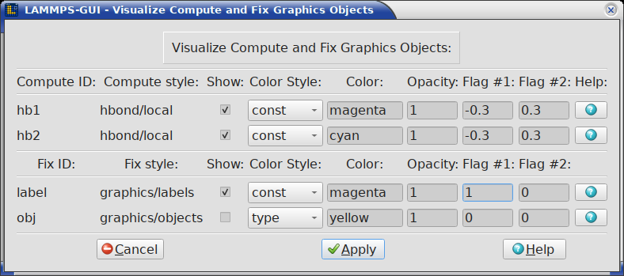

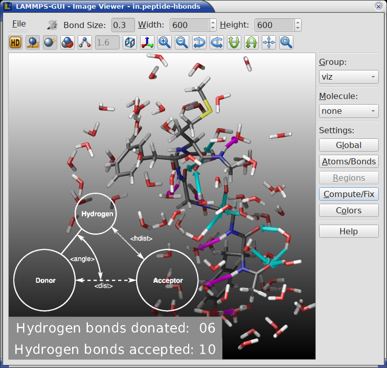

|hbonds|  |fixsetting|

For each compute or fix that supports graphics output, the following
settings can be adjusted:

- **Compute/Fix ID**: The identifier of the compute or fix (read-only).
- **Style**: The compute or fix style name (read-only).
- **Show** (checkbox): Enable or disable visualization of the graphics
  objects from this compute or fix.
- **Color Style**: Select the coloring mode -- *type*, *element*, or
  *const* (constant color).
- **Color**: The color to use when *const* color style is selected.
  Accepts `named colors <https://sparta.github.io/dump_image.html>`_
  or hex color values.
- **Opacity**: The opacity of the graphics objects (range: 0.0 -- 1.0).
- **Flag #1** / **Flag #2**: Style-specific numeric flags that control
  additional rendering options.  Their meaning depends on the
  specific compute or fix style.

Each row also has a **Help** button that opens the SPARTA documentation
page for the corresponding compute or fix style, jumping directly to the
"Dump image info" section that describes the available graphics objects
and flag settings.

Press **Apply** to apply the settings and re-render the image, or
**Cancel** to discard changes.  The general **Help** button at the
bottom opens the SPARTA `dump image
<https://sparta.github.io/dump_image.html>`_ documentation.

------------

.. _customcolors:

Atom Type Color Customization
-----------------------------

.. index:: per-type colors
.. index:: color customization

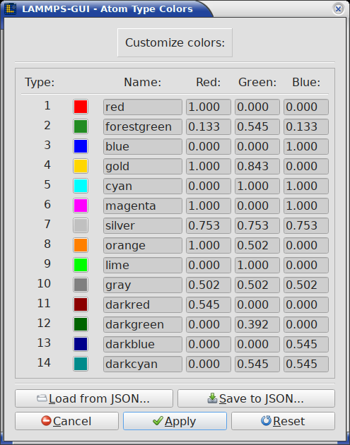

This dialog allows customizing the current color definitions used for
per-type coloring, reset them to the default settings, and load or save
them using `JSON format <https://www.json.org/>`_ files.

The dialog contains as many color rows as the current system has atom
types and it is initialized from the current list of colors.  If there
are fewer types, then only the first part of that list is used.  If
there are more types, then the list of colors is used multiple times and
wraps around.  When the list is too long to fit into the dialog window,
it can be scrolled up and down as needed.

The changes are applied to the image only after the "Apply" button is
clicked and the dialog closed.  At this step, the list of colors is
updated with the colors in the dialog and expanded, if needed.  When the
"Cancel" button is pressed, the edits are discarded and the original
list of colors retained.  Clicking on the "Reset" button will reset the
list of colors to its default values.

With the "Load from JSON" button a list of definitions for per-type
colors is loaded from a `JSON format <https://www.json.org/>`_ file.
The list may contain either more or fewer definitions than the current
system has atom types.  The "Save to JSON" button instead saves the
edited list of definitions to a file.  The list may be loaded later to
restore a previous color assignment.

.. _json_format:

.. index:: JSON format
.. index:: JSON color file

.. admonition:: JSON file format for colors and lighting definitions

  The `JSON format <https://www.json.org/>`_ file for color and lighting
  definitions has the following structure and is compatible with the
  format used by the SPARTA commands `dump_modify savecolors
  <https://sparta.github.io/dump_image.html>`_ and `dump_modify
  loadcolors <https://sparta.github.io/dump_image.html>`_.  The file can
  be validated with the JSON schema file at
  https://sparta.github.io/json/color-schema.json.

  The "application", "format", "revision" entries are *required* and are
  checked for on reading so that files without them are rejected.  Also
  the "colors" list is *required* with color definitions of three
  entries each: "red", "green", and "blue" that have the value of the
  corresponding color component given as a floating point number in the
  range from 0.0 to 1.0 inclusive.  The "lights" object is *optional*
  (SPARTA-GUI will display a warning if it is missing) and contains the
  intensity settings for the four light sources: "ambient", "key",
  "fill", and "back" also in the range from 0.0 to 1.0 inclusive.

  Here is an example with just two colors (red and green) and default
  lighting settings:

  .. code-block:: JSON

     {
         "application": "SPARTA",
         "format": "colors",
         "revision": 1,
         "schema": "https://sparta.github.io/json/color-schema.json",
         "colors": [
            {
                "blue": 0,
                "green": 0,
                "red": 0.9
            },
            {
                "blue": 0,
                "green": 0.9,
                "red": 0
            }
         ],
         "lights": {
            "ambient": 0.2,
            "back": 0.4,
            "fill": 0.4,
            "key": 0.4
         }
     }

--------------

.. _slideshow:

Image Slide Show
^^^^^^^^^^^^^^^^

.. index:: slideshow
.. index:: animation
.. index:: image sequence
.. index:: movie export
.. index:: image export

When running a SPARTA input containing a `dump image
<https://sparta.github.io/dump_image.html>`_ command with SPARTA-GUI, the
"Slide Show" window opens to load and display the images created by
SPARTA as they are written.  This is a convenient way to visually
monitor the progress of the simulation.  It also can be used as an
effective way to refine visualizations created with the :ref:`Snapshot
Image Viewer <snapshot_viewer>`.

.. warning::

   When two or more ``dump image`` commands are active at the same time,
   the slide show picks up the images from all of them and displays them
   interleaved in the order they are written.  This is usually not
   intended, but cannot be detected by SPARTA-GUI before the run has
   started and the images have already been mixed.  To avoid it, make
   sure that only one ``dump image`` command is active at any time
   during a run, for example by removing a no longer needed dump with an
   `undump command <https://sparta.github.io/undump.html>`_.

The same window can also display existing image files that were not
created by the current session: select one or more files with *File* ->
*View Image or Movie File(s)...* (see :ref:`the File menu <files>`) to
review images produced by an external (for example large parallel)
simulation, or to revisit images from an earlier run without rerunning
it.  Image formats that Qt cannot read natively are converted on demand
with `ImageMagick <https://imagemagick.org/>`_ if it is available.  Each
such file is converted only once and the converted copy is reused while
the window is open, so displaying it repeatedly neither repeats the
conversion nor repeats any complaint its format may provoke from Qt (the
Targa/TGA decoder is a common source of those).  A file that can be read
by neither is reported once on the console and then skipped.  When the
slide show is opened this way, the controls that act on a running
simulation (such as stopping the run or sending images to the trash) are
hidden.

.. versionadded:: 2.1

   Existing image files can be loaded into the slide show with *Open
   Image File(s)*, and image files opened with *File* -> *View* are shown
   here instead of as text.

Movie files can be selected in the same dialog; their frames are then
extracted into individual images as described in :ref:`Importing movie
files <movie_import>` below.

.. versionadded:: 3.0.2

   Movie files can be imported into the slide show viewer, and converted
   images are cached instead of being converted again for every display.

From the slide show window the following global keyboard shortcuts are
supported: `Ctrl-W`: close window, `Ctrl-Q`: quit application, `Ctrl-/`:
stop running simulation.  Other keyboard shortcuts are connected to some
of the controls and listed in their documentation below.

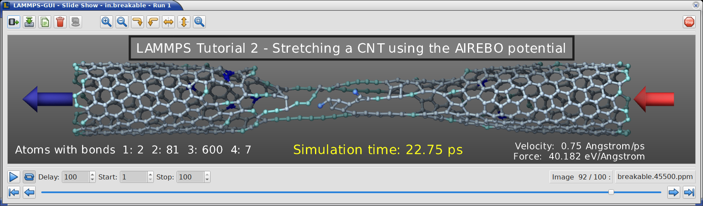

.. _movie_import:

Importing movie files
---------------------

.. index:: movie import

Movie files (``.mp4``, ``.mkv``, ``.webm``, ``.avi``, ``.mov``, and so on,
as well as animated GIF files) can be opened with *File* -> *View Image or
Movie File(s)...* just like image files.  Since the slide show viewer
displays individual images, the frames of a movie must first be
decompressed into a sequence of image files.  This requires the `FFmpeg
<https://ffmpeg.org/>`_ programs ``ffmpeg`` and ``ffprobe``; it is the
inverse of the movie export described below.

When a movie file is selected, a dialog reports its properties and asks
for confirmation before any frames are extracted:

- **First frame** and **Last frame** select the range of the movie to
  extract.
- **Frame interval** thins out that range: an interval of 1 extracts every
  frame, 2 every other frame, and so on.  This is useful to skim a long
  movie without decompressing all of it.
- **Estimated size** is how much temporary disk space the extracted
  images are expected to need.  It is obtained by decoding a single frame
  in the middle of the movie and multiplying its size by the number of
  selected frames, so it is an approximation.  A highlighted warning
  appears when the estimate exceeds one gigabyte, when it would use up
  most of the free space on the volume holding the temporary folder, or
  when more than 1000 images would be extracted.

Because the frames are stored as individual images and not as a
compressed video stream, they usually take up substantially more space
than the movie file itself.  The extracted frames are written to a
temporary folder and are deleted again when the slide show window is
closed.  Below the navigation slider each extracted image is labeled with
the name of the movie and its frame number in it.

Slide show controls
-------------------

.. index:: slideshow controls

There are controls and displays above and below the image.  If you are
uncertain about the function of a specific button, you can place the
cursor on top of it and a descriptive tooltip will appear.

The **toolbar** at the top of the Slide Show window provides the
following controls, organized from left to right:

- **Export to movie** (`Ctrl-E`): Export the active range of images (see
  the **Start** and **Stop** controls below) to a movie file or `animated
  GIF file <https://en.wikipedia.org/wiki/GIF#Animated_GIF>`_.  This requires
  that either the `FFmpeg program <https://ffmpeg.org/>`_ or the
  `ImageMagick software <https://imagemagick.org/>`_ are installed.
  Supported output formats include MP4, MKV, AVI, MPG, MPEG, WEBM, and
  animated GIF.  The file format is determined by the file name
  extension.  Any active image transformations (rotation, mirroring, see
  below) are applied to the exported movie.
- **Save current image** (`Ctrl-S`): Save the currently displayed image
  to a file, including any applied transformations (rotation, mirroring,
  see below).  The file format is inferred from the file name extension.
  When the `ImageMagick software <https://imagemagick.org/>`_ is
  installed, additional file formats beyond those natively supported by
  the `Qt library <https://doc.qt.io/qt-6/qtimageformats-index.html>`_
  become available.
- **Copy to clipboard** (`Ctrl-C`): Copy the current image to the system
  clipboard for pasting it into another application.  This requires
  support from the receiving application, which is the case for many
  common applications like document editors and web browsers.
- **Delete selected images**: Remove the image files in the currently
  selected range (see the **Start** and **Stop** controls below) from
  disk.  A confirmation dialog reports how many files will be removed
  before they are deleted.  With the default range (first to last image)
  this removes the entire sequence.  Since the number of image files can
  be large for long simulations, this provides a safe way to clean up the
  working directory without risk of accidentally deleting other files.
  This will, however, only delete images of the last run.  If that was
  stopped before completion or the output filename has changed, older
  images created by previous runs will not be deleted.  Deleting an image
  also discards its converted copy from the image cache described next.
- **Image cache**: An indicator that is grayed out while the image cache
  is empty and shown in color once it holds anything.  Its tooltip reports
  how many converted images and extracted movie frames are cached and how
  much temporary disk space they occupy.  Pressing it discards the
  converted images after a confirmation; they are converted again the next
  time they are displayed, so nothing is lost but time.  Extracted movie
  frames are never discarded this way, since re-creating them requires
  running FFmpeg over the movie again, and the button is therefore
  disabled when the cache holds nothing but frames.  The entire cache is
  removed when the Slide Show window is closed.

  .. versionadded:: 3.0.2

- **Zoom in**: Increase the displayed image size by scaling it up. Every
  click on the button increases the zoom factor by 10 percent.
- **Zoom out**: Decrease the displayed image size by scaling it
  down. Every click on the button decreases the zoom factor by 10
  percent until a minimum zoom factor of 0.1.
- **Rotate clockwise**: Rotate the displayed image 90 degrees clockwise.
- **Rotate counter-clockwise**: Rotate the displayed image 90 degrees
  counter-clockwise.
- **Mirror horizontally**: Flip the displayed image along the vertical
  axis.
- **Mirror vertically**: Flip the displayed image along the horizontal
  axis.
- **Reset image**: Reset the displayed image to the original image. This
  reverts all zoom, rotate, and mirror operations.
- **Fit window**: Resize the window so the displayed image is shown at
  its full size, without scroll bars or unused space.  This undoes a
  manual resize of the window; the window is never grown beyond a
  fraction of the screen, so scroll bars remain for very large images.

  .. versionadded:: 3.0.2

- **Stop Simulation** (`Ctrl-/`): Stop a running simulation.

These image transformations are useful when the simulation images need
to be adjusted for presentation purposes.  The same transformations are
also applied when exporting images or movies.

The **playback controls** below the image let you select the displayed
image, restrict the active range, and control the slideshow settings:

- **Play**: Start playing the animation, advancing through the active
  range defined by the **Start** and **Stop** controls.
- **Loop**: Toggle continuous looping of the animation.  When enabled,
  playback wraps around from the last image of the active range back to
  the first.
- **Delay**: Set the delay in milliseconds between frames
  during animation playback.
- **Start**: First image of the active range.  Animation, single
  stepping, movie export, and image deletion are all restricted to
  images at or after this position.  Defaults to the first image.
- **Stop**: Last image of the active range.  Defaults to the last image
  and keeps following the growing sequence while a simulation produces
  new images, unless it has been set to a specific value.

- **First**: Jump to the first image of the active range.
- **Previous**: Step back to the previous image.
- The **slider control** selects a frame in the image sequence by moving
  the slider position.  Its track is colored to indicate the active
  range: positions inside the **Start** to **Stop** range are drawn in
  blue, while the skipped images outside it are drawn in red.
- **Next**: Step forward to the next image.
- **Last**: Jump to the last image of the active range.

.. versionadded:: 2.1

   The **Start** and **Stop** controls restrict animation, single
   stepping, movie export, and deletion to a selected range of images,
   and the navigation slider highlights that range in color.
