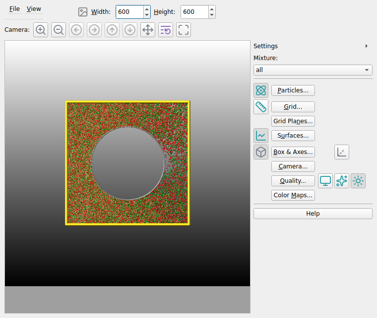
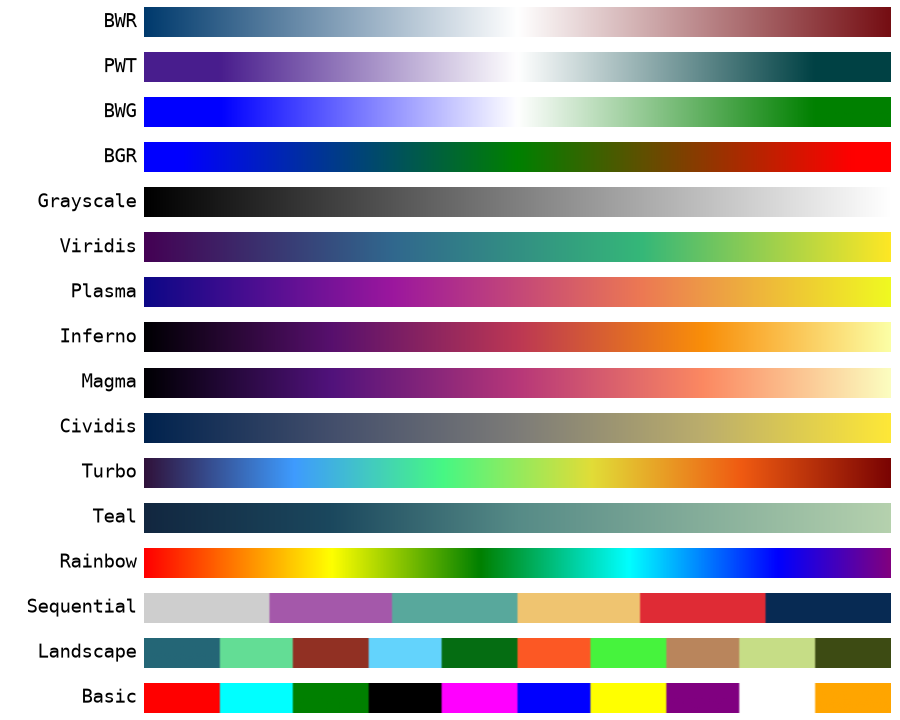

*************
Visualization
*************

.. _snapshot_viewer:

Snapshot Image Viewer
^^^^^^^^^^^^^^^^^^^^^

.. index:: snapshot viewer
.. index:: image viewer
.. index:: visualization
.. index:: dump image

By selecting the *Create Image* entry in the *Run* menu, or by hitting
the `Ctrl-I` (`Command-I` on macOS) keyboard shortcut, or by clicking on
the "palette" button in the status bar of the :doc:`Editor window
<editor>`, SPARTA-GUI sends a `dump image
<https://sparta.github.io/doc/dump_image.html>`_ command to SPARTA and
reads back the resulting snapshot image with the current state of the
system into an image viewer.  This functionality is *not* available
*during* an ongoing run.  In case SPARTA is not yet initialized,
SPARTA-GUI tries to identify the line with the first `run
<https://sparta.github.io/doc/run.html>`_ command and executes all
commands in the editor up to that line, and then executes a "run 0"
command.  This initializes the system so an image of the initial state
of the system can be rendered.  If there was an error in that process,
a dialog with the error message will appear.

The image is rendered by SPARTA's built-in ray-tracing renderer, the
same code that produces the images of the `dump image
<https://sparta.github.io/doc/dump_image.html>`_ command.  All four
kinds of entities that SPARTA can draw are supported:

- **particles**, selected through a `mixture
  <https://sparta.github.io/doc/mixture.html>`_ and colored and sized by
  particle attributes,
- **grid cells**, rendered as (semi-transparent) volumes colored by
  owning processor or by per-grid compute or fix data,
- **grid cut planes** through the grid perpendicular to the x, y, or z
  axis, colored like grid cells, and
- **surface elements**, colored by a constant color, by owning
  processor, or by per-surf compute or fix data.

Automatic settings
------------------

By default, SPARTA-GUI renders the particles of the mixture "all",
colored and sized by their species type using the default assignments
of the `dump image <https://sparta.github.io/doc/dump_image.html>`_
command.  When the simulation defines surface elements, they are shown
as well.  When the system does not contain any particles yet, the grid
cells are rendered instead, so the first image is not just an empty
box.  All of these choices can be changed in the settings dialog
described below.

-----------

Customizations
--------------

The Image Viewer controls described below support significant
customization of the default visualization through the toolbar buttons,
editable text fields, and additional dialogs.  This covers the full set
of options of the `dump image
<https://sparta.github.io/doc/dump_image.html>`_ and `dump_modify
<https://sparta.github.io/doc/dump_modify.html>`_ commands.  After each
change is applied, SPARTA-GUI will have SPARTA re-create the displayed
image with the updated settings.  The resulting image can be saved or
copied to the clipboard and pasted into a compatible application.

.. admonition:: Delays in updating the image
   :class: note

   Some visualization settings, especially enabling SSAO and FSAA (see
   below) or massively enlarging the image size, can significantly
   increase the time required for SPARTA to render the image.  While in
   most cases the image will be updated in a fraction of a second,
   complex visualizations may take multiple seconds.  While SPARTA is
   rendering an updated image, the small color palette icon in the
   menu bar is colored |palette| and will be grayed out |inactive| when
   rendering is complete.

For further customization or for making the visualization available
when running the simulation with SPARTA directly (e.g. when running in
parallel on a cluster after enlarging the system), you can copy the
current `dump image <https://sparta.github.io/doc/dump_image.html>`_
and `dump_modify <https://sparta.github.io/doc/dump_modify.html>`_
commands to the clipboard with the **Copy dump image command** action,
so they can be pasted into a SPARTA input script in either the included
:doc:`text editor window <editor>` or some other text editor and
adjusted according to the documentation.

The resulting images will be shown automatically in the :ref:`slide show
viewer <slideshow>` when running the simulation with the thus modified
input from SPARTA-GUI.  This is an effective strategy for interactively
composing publication quality visualizations of a DSMC simulation.

-----------

Available controls
------------------

.. index:: image viewer controls

The Image Viewer window consists of three main areas: a menu and camera
strip at the top, the rendered image in the center, and the settings
sidebar on the right side.  The sidebar has one row per subject --
particles, grid, grid planes, surfaces, box, camera, quality, color maps
-- and each row carries both the switch that shows or hides that subject
and the button that opens its settings.  Following the general theme of
SPARTA-GUI of extensive keyboard shortcut support, you can select most
controls by using the `Alt` key and the underlined letter.  For example
the *File* menu is opened with `Alt-F` and its entries can be also
selected the same way or using the cursor keys and `Enter`.  Keyboard
shortcuts starting with `Ctrl` usually work globally inside the image
window, that is even when the corresponding menu item is not visible.

The **menu bar row** has:

- The **File** menu with the following entries:
   - **Save As...** (`Ctrl-S`): Save the rendered image to a file.  The
     file format is inferred from the file name extension.  When the
     `ImageMagick software <https://imagemagick.org/>`_ is installed,
     additional file formats beyond those natively supported by the Qt
     library become available.
   - **Copy Image** (`Ctrl-C`): Copy the rendered image to the clipboard
     for pasting it into another application.  This requires support
     from the receiving application, which is the case for many common
     applications like document editors and web browsers.
   - **Copy dump image command** (`Ctrl-D`): Copy the current `dump image
     <https://sparta.github.io/doc/dump_image.html>`_ and `dump_modify
     <https://sparta.github.io/doc/dump_modify.html>`_ commands to the
     clipboard so they can be pasted into a SPARTA input script.  This
     allows the current visualization settings to be reproduced during a
     simulation run, including in the :ref:`slide show viewer <slideshow>`.
   - **Copy dump movie command**: Same as the previous entry, but
     composes a `dump movie
     <https://sparta.github.io/doc/dump_image.html>`_ command instead,
     including *framerate* and *bitrate* `dump_modify
     <https://sparta.github.io/doc/dump_modify.html>`_ settings.  The
     dump movie command requires a SPARTA library compiled with the
     ``SPARTA_FFMPEG`` define.
   - **Load Colors from JSON...** / **Save Colors to JSON...**: Load or
     save the current per-species color assignments from/to a JSON
     format file, so that a customized color assignment can be restored
     later (these settings are otherwise reset when the Image Viewer is
     closed).
   - **Reset Colors**: Reset the per-species colors to the default
     color sequence of the dump image command.
   - **Close** (`Ctrl-W`): Close the Image Viewer window.
   - **Quit** (`Ctrl-Q`): Quit the entire application.
- The **View** menu with the **Settings Sidebar** entry (`F9`), which
  shows or hides the sidebar described below.  Hiding it gives its width
  back to the rendered image, which matters when the viewer shares a
  window with the editor and the log.
- The **busy indicator**, a small palette icon that is colored |palette|
  while SPARTA is rendering a new image and grayed out |inactive| when
  rendering is complete.
- The **Width** (`Alt-W`) and **Height** (`Alt-H`) spin boxes, where
  the size of the rendered image in pixels can be set (the *size*
  keyword).

The **camera row** below the menu bar moves the point of view.  Every
button here re-renders the scene immediately.  From left to right there
are:

- **Zoom in** / **Zoom out**: Adjust the zoom level in 10
  percent increments between 0.1x and 10.0x (the *zoom* keyword).
- **Rotate left** / **Rotate right**: Rotate the view horizontally by
  10 degrees per click (the *phi* angle of the *view* keyword).
- **Rotate up** / **Rotate down**: Rotate the view vertically by
  10 degrees per click (the *theta* angle of the *view* keyword).
  For 2d simulations the view is fixed to look down the z axis and the
  rotation buttons are disabled.
- **Recenter**: Reset the view center (the *center* keyword) to the
  middle of the simulation box.
- **Reset**: Reset the view to the default orientation and zoom level.
- **Fit window**: Resize the window so the image is shown at its full
  size, without scroll bars or unused space.  This undoes a manual
  resize of the window; the window is never grown beyond a fraction of
  the screen, so scroll bars remain for very large images.

The default image size, some default image quality settings, and some
colors can be changed in the :doc:`Preferences <dialogs>` dialog
window.

The **settings sidebar** on the right side of the window is organized by
subject.  At its top is:

- **Mixture** (`Alt-X`): A drop-down list to select which `mixture
  <https://sparta.github.io/doc/mixture.html>`_ of particles to display
  (default is "all").  Only particles whose species belong to the
  selected mixture are rendered.  The list is retrieved from the
  current SPARTA instance.

Below it is one row per subject.  Each row's named button opens the
:ref:`Dump Image Settings dialog <image_settings_dialog>` described
below at the matching tab, and the icon buttons on the same row switch
that subject on and off without opening anything:

.. list-table::
   :header-rows: 1
   :widths: 22 78

   * - Row
     - Switches on the row
   * - **Particles...** (`Alt-P`)
     - Show or hide the particles (the *particle* keyword).
   * - **Grid...** (`Alt-G`)
     - Show or hide the grid cell volume rendering (the *grid* keyword).
   * - **Grid Planes...** (`Alt-N`)
     - none; the cut planes are configured in the dialog.
   * - **Surfaces...** (`Alt-U`)
     - Show or hide the surface elements (the *surf* keyword).  Only
       enabled when the simulation defines surfaces.
   * - **Box & Axes...** (`Alt-B`)
     - Show or hide the simulation box drawn as colored cylinders (the
       *box* keyword), and show or hide the coordinate axes (the *axes*
       keyword).
   * - **Camera...** (`Alt-C`)
     - none; use the camera row above or the dialog.
   * - **Quality...** (`Alt-Q`)
     - `Screen Space Ambient Occlusion
       <https://en.wikipedia.org/wiki/Screen_space_ambient_occlusion>`_
       for a more spatial, depth-shaded appearance (the *ssao*
       keyword); `Full Scene Anti-Aliasing
       <https://en.wikipedia.org/wiki/Spatial_anti-aliasing#Super_sampling_/_full-scene_anti-aliasing>`_,
       which renders at double resolution and scales down for smoother
       edges (the *fsaa* keyword); and shiny versus matte rendering of
       spheres and cylinders (the *shiny* keyword).  All three cost
       extra CPU time per frame.
   * - **Color Maps...** (`Alt-M`)
     - none; the maps are edited in the dialog.

Two more controls belong to the sidebar itself:

- The arrow in the sidebar's **Settings** header collapses it to a
  narrow strip, and the arrow on that strip brings it back.  The
  **View > Settings Sidebar** menu entry (`F9`) does the same thing.
- **Help**: Opens this documentation page for the visualization
  features in SPARTA-GUI in a web browser.

.. index:: image viewer; interactive view
.. index:: rotate; mouse

The rendered image also responds directly to the mouse for a more
interactive feel: **drag** with the left mouse button to rotate the view
(horizontal motion changes the azimuth, vertical motion the elevation),
hold **Shift** while dragging to pan the view center, and use the **mouse
wheel** to zoom in and out.  Each gesture re-renders through the same path
as the toolbar buttons, so the same limits apply (rotation is disabled for
2d simulations).

The image is re-rendered after each change to the buttons, text fields,
settings dialog, or mouse gesture, and when there are many particles, grid
cells, or surface elements to render and high quality images with
anti-aliasing are requested, re-rendering may take several seconds (it uses
SPARTA's software renderer -- there is no GPU acceleration).  For fluid,
GPU-accelerated exploration, export the geometry to :ref:`ParaView
<paraview_export>`.

---------------

.. _image_settings_dialog:

Dump Image Settings dialog
--------------------------

.. index:: image settings
.. index:: dump image settings
.. index:: dump_modify

While some persistent default settings for the image output can be
configured in the "Snapshot Image" tab of the :ref:`Preferences dialog
<image_preferences>`, the full set of options of the `dump image
<https://sparta.github.io/doc/dump_image.html>`_ and `dump_modify
<https://sparta.github.io/doc/dump_modify.html>`_ commands is
configured in the "Dump Image Settings" dialog.  Settings not stored by
the preferences are reset when the image viewer window is closed (the
per-species colors can be saved to a JSON file, see above).  The dialog
is organized into eight tabs, and the buttons in the settings panel
open it directly at the respective tab.  Press **Apply** to apply the
current settings and re-render the image, or **Cancel** to discard
changes.  The **Help** button opens the SPARTA `dump image
<https://sparta.github.io/doc/dump_image.html>`_ documentation.

.. TODO screenshot: capture the Dump Image Settings dialog (e.g. the
   Particles and the Grid tabs) as JPG/sparta-gui-image-settings.png
   together with a rendered image of a SPARTA example as
   JPG/sparta-gui-image.png, then re-enable this figure.
..
.. .. image:: JPG/sparta-gui-image-settings.png
..    :align: center
..    :width: 62%

.. _particle_settings:

Particles tab
"""""""""""""

.. index:: particle settings
.. index:: particle coloring
.. index:: mixture

Controls how particles are rendered:

- **Show particles** (checkbox): Enable or disable rendering of
  particles (the *particle* keyword).
- **Mixture**: Select the `mixture
  <https://sparta.github.io/doc/mixture.html>`_ of particles to render;
  the same setting as the drop-down list in the settings panel.
- **Color by**: Select what determines the color of each particle.
  The basic choices are *type* (the species type, with one color per
  type) and *proc* (the owning processor).  In addition, any
  per-particle attribute known to the `dump particle
  <https://sparta.github.io/doc/dump.html>`_ command can be selected
  (``id``, ``x``, ``y``, ``z``, ``vx``, ``vy``, ``vz``, ``ke``,
  ``erot``, ``evib``, and so on), as well as references to
  particle-style `variables <https://sparta.github.io/doc/variable.html>`_
  (``v_name``), per-particle `compute
  <https://sparta.github.io/doc/compute.html>`_ or `fix
  <https://sparta.github.io/doc/fix.html>`_ output (``c_ID``,
  ``c_ID[col]``, ``f_ID``, ``f_ID[col]``), and `custom per-particle
  attributes <https://sparta.github.io/doc/Section_howto.html#howto_17>`_
  (``p_name``, ``i_name``, ``d_name``).  The available compute, fix,
  and variable references are queried from the current SPARTA instance.
  When a numeric attribute is selected, the colors are determined by
  the *particle* :ref:`color map <colormaps>`.
- **Region clip**: Only render particles inside the selected `region
  <https://sparta.github.io/doc/region.html>`_ (the *region* dump_modify
  keyword; default "none").
- **Diameter**: Select how the particle diameter is determined: *By
  type* (using the per-species diameter table below), by a numeric
  per-particle *Attribute* (like the color attributes above), or a
  constant *Value* in simulation length units (the *pdiam* keyword).
- **Per-species colors and diameters**: A table with one row per
  species of the current simulation, showing the species name and
  allowing to customize the color (the *pcolor* dump_modify keyword)
  and per-type diameter (the *pdiam* dump_modify keyword) for each.
  The table scrolls when the simulation has many species.

.. _grid_settings:

Grid tab
""""""""

.. index:: grid visualization
.. index:: grid settings
.. index:: grid groups

Controls the volume rendering of the cells of the `simulation grid
<https://sparta.github.io/doc/create_grid.html>`_:

- **Render grid cells (volume)** (checkbox): Enable or disable
  rendering of the grid cells as semi-transparent volumes (the *grid*
  keyword).  Grid volume rendering and grid cut planes (next tab) are
  mutually exclusive; enabling one disables the other.
- **Color by**: Select what determines the color of each grid cell:
  *proc* (the owning processor) or any per-grid value produced by a
  `compute <https://sparta.github.io/doc/compute.html>`_ or `fix
  <https://sparta.github.io/doc/fix.html>`_ (``c_ID``, ``c_ID[col]``,
  ``f_ID``, or ``f_ID[col]``), for example a `compute grid
  <https://sparta.github.io/doc/compute_grid.html>`_ that tallies
  density or temperature per cell.  Coloring by a computed value uses
  the *grid* :ref:`color map <colormaps>`.
- **Proc colors**: The color (or a list of colors like
  ``red/green/blue``) used when coloring by *proc* (the *gcolor*
  dump_modify keyword).
- **Grid group**: Restrict the rendering to a `grid group
  <https://sparta.github.io/doc/group.html>`_ (the *gridgroup*
  dump_modify keyword; default is "all").
- **Grid cell outlines (gline)** (checkbox): Draw the outline of each
  grid cell (the *gline* keyword), with fields for the outline
  diameter as a fraction of the box size and the outline color (the
  *glinecolor* dump_modify keyword).

.. _plane_settings:

Grid Planes tab
"""""""""""""""

.. index:: grid cut planes
.. index:: gridx
.. index:: gridy
.. index:: gridz

Rather than rendering the entire grid as volumes, it is often clearer
to show one or more *cut planes* through the grid.  This tab configures
the *gridx*, *gridy*, and *gridz* keywords of the `dump image
<https://sparta.github.io/doc/dump_image.html>`_ command; it is
mutually exclusive with the grid volume rendering of the previous tab.
For each of the three axis directions there is one group of controls:

- **Show** (checkbox): Enable or disable the cut plane perpendicular to
  this axis.
- **Position**: The coordinate along the axis at which the plane cuts
  through the grid (within the simulation box bounds).
- **Color by**: Select what determines the color of the grid cells in
  the plane: *proc* or a per-grid `compute
  <https://sparta.github.io/doc/compute.html>`_ or `fix
  <https://sparta.github.io/doc/fix.html>`_ value, exactly like for the
  grid volume rendering.

Each of the three planes has its *own* :ref:`color map <colormaps>`
(the *gridx*, *gridy*, and *gridz* modes of the *cmap* dump_modify
keyword), so, for example, a density plane and a temperature plane can
use different maps and ranges in the same image.

.. _surf_settings:

Surfaces tab
""""""""""""

.. index:: surface visualization
.. index:: surface settings
.. index:: surf groups

Controls the display of the `surface elements
<https://sparta.github.io/doc/read_surf.html>`_ defined in the
simulation.  The controls are disabled when the current simulation
defines no surfaces.

- **Show surface elements** (checkbox): Enable or disable rendering of
  the surface elements (the *surf* keyword).
- **Color by**: Select what determines the color of each surface
  element: *one* (a single constant color), *proc* (the owning
  processor), or any per-surf value produced by a `compute
  <https://sparta.github.io/doc/compute.html>`_ or `fix
  <https://sparta.github.io/doc/fix.html>`_ (``c_ID``, ``c_ID[col]``,
  ``f_ID``, or ``f_ID[col]``), for example a `compute surf
  <https://sparta.github.io/doc/compute_surf.html>`_ that tallies
  fluxes on the surface elements.  Coloring by a computed value uses
  the *surf* :ref:`color map <colormaps>`.
- **Color for "one"**: The constant color used with the *one* color
  mode (the *scolor* dump_modify keyword).
- **Element diameter**: The diameter used to render the line segments
  of 2d surfaces, as a fraction of the shortest box length.
- **Proc colors**: The color (or a list of colors) used when coloring
  by *proc*.
- **Surface group**: Restrict the rendering to a `surf group
  <https://sparta.github.io/doc/group.html>`_ (the *surfgroup*
  dump_modify keyword; default is "all").
- **Surface element outlines (sline)** (checkbox): Draw the outline of
  each surface element (the *sline* keyword), with fields for the
  outline diameter and the outline color (the *slinecolor* dump_modify
  keyword).

.. _box_settings:

Box & Axes tab
""""""""""""""

.. index:: simulation box
.. index:: sub-box
.. index:: axes

Controls the display of the simulation box, the processor sub-boxes,
and the coordinate axes:

- **Simulation box** (checkbox): Draw the outline of the simulation box
  (the *box* keyword), with fields for the edge diameter as a fraction
  of the box size and the color (the *boxcolor* dump_modify keyword).
- **Processor sub-boxes** (checkbox): Draw the outlines of the
  per-processor sub-domains (the *subbox* keyword), with fields for
  the edge diameter and the color (the *subboxcolor* dump_modify
  keyword).  Since SPARTA-GUI runs SPARTA on a single processor, the
  sub-box coincides with the simulation box; the setting is mainly
  useful when composing a dump image command for a parallel run with
  the **Copy dump image command** action.
- **Coordinate axes** (checkbox): Draw the coordinate axes next to the
  simulation box (the *axes* keyword), with fields for the axes length
  and diameter as fractions of the box size.

.. _camera_settings:

Camera tab
""""""""""

.. index:: camera settings
.. index:: view angles

Adjusts how the simulation box is projected into the image (the *view*,
*center*, *up*, and *zoom* keywords):

- **View theta**: The viewing angle in degrees away from the positive
  z-axis.  Disabled for 2d systems, where SPARTA always looks down the
  z-axis.
- **View phi**: The azimuthal viewing angle in degrees around the
  z-axis.  Disabled for 2d systems.
- **Center**: Whether the view center is *static* or *dynamic* (the
  "s"/"d" flag of the *center* keyword) and its x, y, and z positions
  as fractions of the box dimensions (0.5 = center of the box).
- **Camera up**: The components of the vector that points up in the
  image.  The vector does not need to be normalized, but it must not
  be all zeros.
- **Zoom**: The zoom factor of the view (range: 0.1 -- 10.0, where
  values larger than 1.0 zoom in).  This is the same setting that the
  zoom in/out buttons of the toolbar change in steps of 10 percent.
- **Variable** fields: The theta, phi, center, and zoom settings can
  alternatively be driven by equal-style `variables
  <https://sparta.github.io/doc/variable.html>`_ so that the camera
  moves during a run.  This has no effect on the static snapshot in
  the Image Viewer, but is included when copying the dump image
  command for use in an input script (e.g. for animations).

.. note::

   The *persp* keyword of the dump image command (depth perspective)
   is documented but not supported by SPARTA (it stops with an error
   when used), therefore the perspective setting is shown grayed out in
   SPARTA-GUI and all images are rendered without perspective.

.. _quality_settings:

Quality tab
"""""""""""

.. index:: rendering quality
.. index:: background color
.. index:: lighting

Controls rendering quality, the background, and the lighting:

- **SSAO** (checkbox): Enable or disable Screen Space Ambient
  Occlusion for depth-shaded rendering (the *ssao* keyword), with a
  field for the shading **Strength** (range: 0.0 -- 1.0).
- **FSAA** (checkbox): Enable or disable full-scene anti-aliasing (the
  *fsaa* keyword).
- **Shininess**: The shininess factor for rendering spheres and
  cylinders (range: 0.0 -- 1.0, where 0.0 is matte and 1.0 is fully
  shiny; the *shiny* keyword).
- **Background**: The background color of the image (the *backcolor*
  dump_modify keyword).
- **Gradient to** (checkbox): When enabled, a vertical background
  gradient is drawn from the background color at the bottom to the
  second color at the top (the *backcolor2* dump_modify keyword).
- **Lights**: The intensities (range: 0.0 -- 1.0) of the four light
  sources used in the rendering (the *lights* dump_modify keyword):
  *ambient* (uniform, non-directional base lighting), *key* (the
  primary directional light), *fill* (the secondary light softening
  the shadows of the key light), and *back* (the light separating
  objects from the background).

.. _colormaps:

Color Maps tab
""""""""""""""

.. index:: color map
.. index:: reversible color map

Whenever particles, grid cells, grid cut planes, or surface elements
are colored by a numeric value, that value is translated into a color
through a color map (the *cmap* keyword of the `dump_modify
<https://sparta.github.io/doc/dump_modify.html>`_ command).  SPARTA-GUI
maintains **six independent color maps**, one for each of the *cmap*
modes of SPARTA: *particle*, *grid*, *surf*, *gridx*, *gridy*, and
*gridz*.  The **Color map for:** selector at the top of the tab picks
which of the six maps the remaining controls edit:

- **Customize this color map** (checkbox): When unchecked, no *cmap*
  command is emitted for this mode and SPARTA's built-in default map
  (blue-to-red, continuous, over the automatically determined value
  range) is used.
- **Map**: Select the color map.  Currently available continuous color
  maps are: *BWR* (blue-white-red, a smoothed version of SPARTA's
  default map), *PWT* (purple-white-teal), *BWG* (blue-white-green),
  *BGR* (blue-green-red), *Grayscale*, *Viridis*, *Plasma*, *Inferno*,
  *Magma*, *Cividis*, and *Turbo* (from matplotlib), *Teal*, and
  *Rainbow*.  *Sequential*, *Landscape*, and *Basic* are maps with
  discrete colors.
- **Reverse** (checkbox): Mirror the selected color map so its low and
  high ends are swapped.
- **Minimum** / **Maximum**: Set the range of the color map.  Use *min*
  and *max* to have SPARTA determine the bound automatically from the
  data of each rendered image, or specify an explicit numeric value to
  pin the range (recommended when comparing images, e.g. in the slide
  show).
- **Style**: How the color stops of the map are laid out: *continuous*
  (interpolated), *discrete* (equally wide value bins), or *sequential*
  (colors repeat in bins of a fixed width).
- **Range**: Whether the color stops are interpreted as *fractional*
  positions within the min/max range or as *absolute* values (the
  latter requires numeric minimum and maximum).
- **Bin size**: The value bin width for the *sequential* style.

The color maps offered by SPARTA-GUI are shown below; the continuous
maps are interpolated between color stops, while *Sequential*,
*Landscape*, and *Basic* use discrete colors.

.. _colormap_preview:

   The color maps offered for coloring particles, grid cells, grid cut
   planes, and surface elements by value.

These color maps are defined in a single table in the C++ source, which
makes them simple to add or modify; see :ref:`add_colormap` in the
Programmer's Guide for step-by-step instructions.  Fully customized
maps beyond these presets can be composed manually with the `dump_modify
cmap <https://sparta.github.io/doc/dump_modify.html>`_ command after
exporting the current settings with **Copy dump image command**.

--------------

.. _slideshow:

Image Slide Show
^^^^^^^^^^^^^^^^

.. index:: slideshow
.. index:: animation
.. index:: image sequence
.. index:: movie export
.. index:: image export

When running a SPARTA input containing a `dump image
<https://sparta.github.io/doc/dump_image.html>`_ command with
SPARTA-GUI, the "Slide Show" window opens to load and display the
images created by SPARTA as they are written.  This is a convenient way
to visually monitor the progress of the simulation.  It also can be
used as an effective way to refine visualizations created with the
:ref:`Snapshot Image Viewer <snapshot_viewer>`.

.. warning::

   When two or more ``dump image`` commands are active at the same time,
   the slide show picks up the images from all of them and displays them
   interleaved in the order they are written.  This is usually not
   intended, but cannot be detected by SPARTA-GUI before the run has
   started and the images have already been mixed.  To avoid it, make
   sure that only one ``dump image`` command is active at any time
   during a run, for example by removing a no longer needed dump with an
   `undump command <https://sparta.github.io/doc/undump.html>`_.

.. admonition:: dump movie
   :class: note

   As an alternative to exporting the slide show images to a movie
   (described below), SPARTA itself supports writing a movie directly
   with the `dump movie <https://sparta.github.io/doc/dump_image.html>`_
   command when the SPARTA library was compiled with the
   ``SPARTA_FFMPEG`` define.  In that case the images are piped directly
   into FFmpeg, and the frame rate and bit rate can be set with the
   *framerate* and *bitrate* keywords of the `dump_modify
   <https://sparta.github.io/doc/dump_modify.html>`_ command.

The same window can also display existing image files that were not
created by the current session: select one or more files with *File* ->
*View Image or Movie File(s)...* (see :ref:`the File menu <files>`) to
review images produced by an external (for example large parallel)
simulation, or to revisit images from an earlier run without rerunning
it.  Image formats that Qt cannot read natively are converted on demand
with `ImageMagick <https://imagemagick.org/>`_ if it is available.  Each
such file is converted only once and the converted copy is reused while
the window is open, so displaying it repeatedly neither repeats the
conversion nor repeats any complaint its format may provoke from Qt.  A
file that can be read by neither is reported once on the console and
then skipped.  When the slide show is opened this way, the controls
that act on a running simulation (such as stopping the run or sending
images to the trash) are hidden.

Movie files can be selected in the same dialog; their frames are then
extracted into individual images as described in :ref:`Importing movie
files <movie_import>` below.

From the slide show window the following global keyboard shortcuts are
supported: `Ctrl-W`: close window, `Ctrl-Q`: quit application, `Ctrl-/`:
stop running simulation.  Other keyboard shortcuts are connected to some
of the controls and listed in their documentation below.

.. TODO screenshot: capture the Slide Show window with images of a
   SPARTA example run as JPG/sparta-gui-slideshow.png, then re-enable
   this figure.
..
.. .. image:: JPG/sparta-gui-slideshow.png
..    :align: center

.. _movie_import:

Importing movie files
---------------------

.. index:: movie import

Movie files (``.mp4``, ``.mkv``, ``.webm``, ``.avi``, ``.mov``, and so on,
as well as animated GIF files) can be opened with *File* -> *View Image or
Movie File(s)...* just like image files.  Since the slide show viewer
displays individual images, the frames of a movie must first be
decompressed into a sequence of image files.  This requires the `FFmpeg
<https://ffmpeg.org/>`_ programs ``ffmpeg`` and ``ffprobe``; it is the
inverse of the movie export described below.

When a movie file is selected, a dialog reports its properties and asks
for confirmation before any frames are extracted:

- **First frame** and **Last frame** select the range of the movie to
  extract.
- **Frame interval** thins out that range: an interval of 1 extracts every
  frame, 2 every other frame, and so on.  This is useful to skim a long
  movie without decompressing all of it.
- **Estimated size** is how much temporary disk space the extracted
  images are expected to need.  It is obtained by decoding a single frame
  in the middle of the movie and multiplying its size by the number of
  selected frames, so it is an approximation.  A highlighted warning
  appears when the estimate exceeds one gigabyte, when it would use up
  most of the free space on the volume holding the temporary folder, or
  when more than 1000 images would be extracted.

Because the frames are stored as individual images and not as a
compressed video stream, they usually take up substantially more space
than the movie file itself.  The extracted frames are written to a
temporary folder and are deleted again when the slide show window is
closed.  Below the navigation slider each extracted image is labeled with
the name of the movie and its frame number in it.

Slide show controls
-------------------

.. index:: slideshow controls

There are controls and displays above and below the image.  If you are
uncertain about the function of a specific button, you can place the
cursor on top of it and a descriptive tooltip will appear.

The **toolbar** at the top of the Slide Show window provides the
following controls, organized from left to right:

- **Export to movie** (`Ctrl-E`): Export the active range of images (see
  the **Start** and **Stop** controls below) to a movie file or `animated
  GIF file <https://en.wikipedia.org/wiki/GIF#Animated_GIF>`_.  This requires
  that either the `FFmpeg program <https://ffmpeg.org/>`_ or the
  `ImageMagick software <https://imagemagick.org/>`_ are installed.
  Supported output formats include MP4, MKV, AVI, MPG, MPEG, WEBM, and
  animated GIF.  The file format is determined by the file name
  extension.  Any active image transformations (rotation, mirroring, see
  below) are applied to the exported movie.
- **Save current image** (`Ctrl-S`): Save the currently displayed image
  to a file, including any applied transformations (rotation, mirroring,
  see below).  The file format is inferred from the file name extension.
  When the `ImageMagick software <https://imagemagick.org/>`_ is
  installed, additional file formats beyond those natively supported by
  the `Qt library <https://doc.qt.io/qt-6/qtimageformats-index.html>`_
  become available.
- **Copy to clipboard** (`Ctrl-C`): Copy the current image to the system
  clipboard for pasting it into another application.  This requires
  support from the receiving application, which is the case for many
  common applications like document editors and web browsers.
- **Delete selected images**: Remove the image files in the currently
  selected range (see the **Start** and **Stop** controls below) from
  disk.  A confirmation dialog reports how many files will be removed
  before they are deleted.  With the default range (first to last image)
  this removes the entire sequence.  Since the number of image files can
  be large for long simulations, this provides a safe way to clean up the
  working directory without risk of accidentally deleting other files.
  This will, however, only delete images of the last run.  If that was
  stopped before completion or the output filename has changed, older
  images created by previous runs will not be deleted.  Deleting an image
  also discards its converted copy from the image cache described next.
- **Image cache**: An indicator that is grayed out while the image cache
  is empty and shown in color once it holds anything.  Its tooltip reports
  how many converted images and extracted movie frames are cached and how
  much temporary disk space they occupy.  Pressing it discards the
  converted images after a confirmation; they are converted again the next
  time they are displayed, so nothing is lost but time.  Extracted movie
  frames are never discarded this way, since re-creating them requires
  running FFmpeg over the movie again, and the button is therefore
  disabled when the cache holds nothing but frames.  The entire cache is
  removed when the Slide Show window is closed.
- **Zoom in**: Increase the displayed image size by scaling it up. Every
  click on the button increases the zoom factor by 10 percent.
- **Zoom out**: Decrease the displayed image size by scaling it
  down. Every click on the button decreases the zoom factor by 10
  percent until a minimum zoom factor of 0.1.
- **Rotate clockwise**: Rotate the displayed image 90 degrees clockwise.
- **Rotate counter-clockwise**: Rotate the displayed image 90 degrees
  counter-clockwise.
- **Mirror horizontally**: Flip the displayed image along the vertical
  axis.
- **Mirror vertically**: Flip the displayed image along the horizontal
  axis.
- **Reset image**: Reset the displayed image to the original image. This
  reverts all zoom, rotate, and mirror operations.
- **Fit window**: Resize the window so the displayed image is shown at
  its full size, without scroll bars or unused space.  This undoes a
  manual resize of the window; the window is never grown beyond a
  fraction of the screen, so scroll bars remain for very large images.
- **Stop Simulation** (`Ctrl-/`): Stop a running simulation.

These image transformations are useful when the simulation images need
to be adjusted for presentation purposes.  The same transformations are
also applied when exporting images or movies.

The **playback controls** below the image let you select the displayed
image, restrict the active range, and control the slideshow settings:

- **Play**: Start playing the animation, advancing through the active
  range defined by the **Start** and **Stop** controls.
- **Loop**: Toggle continuous looping of the animation.  When enabled,
  playback wraps around from the last image of the active range back to
  the first.
- **Delay**: Set the delay in milliseconds between frames
  during animation playback.
- **Start**: First image of the active range.  Animation, single
  stepping, movie export, and image deletion are all restricted to
  images at or after this position.  Defaults to the first image.
- **Stop**: Last image of the active range.  Defaults to the last image
  and keeps following the growing sequence while a simulation produces
  new images, unless it has been set to a specific value.

- **First**: Jump to the first image of the active range.
- **Previous**: Step back to the previous image.
- The **slider control** selects a frame in the image sequence by moving
  the slider position.  Its track is colored to indicate the active
  range: positions inside the **Start** to **Stop** range are drawn in
  blue, while the skipped images outside it are drawn in red.
- **Next**: Step forward to the next image.
- **Last**: Jump to the last image of the active range.

.. _vtk_viewer:

Interactive 3D Viewer (VTK)
---------------------------

.. index:: VTK
.. index:: 3D viewer
.. index:: dump particle/vtk
.. index:: dump grid/vtk
.. index:: dump surf/vtk

SPARTA-GUI includes an optional interactive 3D viewer built on the `VTK
<https://vtk.org/>`_ toolkit.  It renders the native VTK files written by
SPARTA's ``dump particle/vtk``, ``dump grid/vtk`` and ``dump surf/vtk``
styles, so — unlike the :ref:`image viewer <snapshot_viewer>`, which shows
a fixed rendered picture — the geometry can be rotated, zoomed and colored
by any field interactively.

The viewer is a build-time option: configure the GUI with ``-D
SPARTA_GUI_USE_VTK=on`` and a VTK library (with development headers, e.g.
``libvtk9-dev``) available to CMake.  When it is not built in, the menu
entries below are simply absent.  To keep the viewer compatible with any
system VTK, it renders off-screen and displays the frames in a normal Qt
widget rather than embedding VTK's own Qt widget; no VTK Qt integration is
required.

.. admonition:: Opening the viewer

   - *View* -> *3D Viewer (VTK)* opens an empty viewer window; use its
     **Open** toolbar button to load one or more ``.vtu`` / ``.vtp`` /
     ``.vtk`` files (for example the output of a ``dump *vtk`` command from
     a completed run).
   - *Run* -> *3D Snapshot (VTK)* (`Ctrl+Shift+3`) renders the current
     simulation state directly: it issues ``dump grid/vtk``,
     ``dump particle/vtk`` and ``dump surf/vtk`` to temporary files and
     loads them.  This requires the loaded SPARTA library to have been
     built with the VTK package; if it was not, the viewer still opens so
     ``.vtu`` / ``.vtp`` files produced elsewhere can be loaded manually.

Each loaded dataset is a layer.  The toolbar offers:

- **Color by**: choose any per-point (particle) or per-cell (grid/surface)
  scalar field; the field names come from the dump attributes.
- **Colormap**: *Rainbow*, *Cool to Warm*, *Viridis* or *Grayscale*, with a
  scalar-bar **Legend** showing the value range.
- **Edges**: outline grid cells / surface elements.
- **Reset View** and **Save Screenshot...** (PNG).

Drag with the left mouse button to rotate, the right (or middle) button to
pan, and the wheel to zoom.

The viewer is intentionally light-weight: it covers loading, orbiting and
field coloring, and defers heavier analysis (clipping, streamlines,
calculators, ...) to ParaView.  It complements — and does not replace — the
:ref:`ParaView export <paraview_export>`: the export works with any SPARTA
build (no VTK package required) and post-processes existing output offline,
while the viewer needs a VTK-enabled build (or pre-written VTK files) but
gives an immediate in-application 3D view.

.. _paraview_export:

Exporting to ParaView
---------------------

.. index:: ParaView
.. index:: visualization; ParaView
.. index:: surf2paraview
.. index:: grid2paraview

For interactive 3D exploration beyond the built-in :ref:`image viewer
<snapshot_viewer>`, SPARTA surface and grid data can be exported to
`ParaView <https://www.paraview.org/>`_.  The *File* menu entry *Export to
ParaView...* (`Ctrl+Shift+E`) opens the :ref:`Export to ParaView dialog
<export_paraview>`, which runs the bundled ``surf2paraview.py`` /
``grid2paraview.py`` conversion scripts with ParaView's ``pvpython``
interpreter and, optionally, launches ParaView on the resulting ``.pvd``.
The scripts are shipped with the installers under
``share/sparta/tools/paraview``; ParaView itself must be installed
separately.  Surface geometry to be visualized (or validated) can first be
prepared with the :ref:`Import Surface wizard <import_surface>`.
